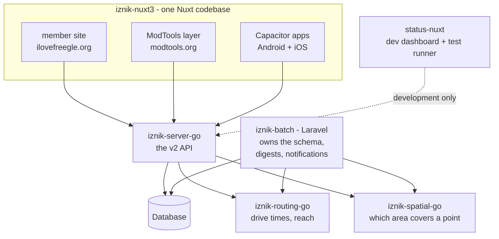

# Architecture and codebase map

This page is the "where does everything live" overview. For the detailed container,
network and profile picture, read [./reference/architecture.md](./reference/architecture.md); this
page will not repeat it.

## The components

Freegle (internally "Iznik") is a monorepo. The main pieces:

| Directory | What it is | README |
|-----------|-----------|--------|
| `iznik-nuxt3/` | Nuxt 4 frontend (the directory name predates the upgrade). Serves **both** the member site (ilovefreegle.org) and, from the `modtools/` subfolder, the moderator app (modtools.org). | `iznik-nuxt3/README.md` |
| `iznik-server-go/` | Go API, **version 2** - the primary API. | `iznik-server-go/README.md` |
| `iznik-batch/` | Laravel batch processing: digests, notifications, scheduled jobs. Owns the database schema (migrations). | `iznik-batch/README.md` |
| `iznik-routing-go/` | Go service for drive-time routing, used by rippling, browse and the sysadmin analytics; includes the reach engine (region labels instead of repeated searches - see `iznik-routing-go/REACH-ENGINE.md`), which also answers per-point drive-time evals without a full-graph sweep. | `iznik-routing-go/README.md` |
| `iznik-spatial-go/` | Go service for spatial lookups (which community covers a point, etc). | `iznik-spatial-go/README.md` |
| `status-nuxt/` | Development status dashboard and test runner. | - |
| `freegle-app/` | A Kotlin Multiplatform native app. An experiment; it does not ship. See [./reference/mobile-app.md](./reference/mobile-app.md). | - |

The mobile apps that members install are **Capacitor builds of `iznik-nuxt3/`** - the same
Vue code as the website, wrapped natively (`iznik-nuxt3/capacitor.config.ts`, `android/`,
`ios/`, `fastlane/`). There is no separate app codebase. `freegle-app/` is a separate
native experiment that does not ship, and any `freegle-mobile/` directory you find is local
scratch that is not in git. Start from
[./reference/mobile-app.md](./reference/mobile-app.md).

## How the frontend is put together

The member site and ModTools are **one Nuxt codebase**. ModTools lives in
`iznik-nuxt3/modtools/` as a Nuxt "layer" that `extends` the main app, so it inherits the
stores, components and composables and adds its own pages. The two are built and deployed
as **separate Netlify sites from the same branch** (`npm run build` for the member site,
`cd modtools && npm run build` for ModTools).

State lives in **Pinia stores** (`iznik-nuxt3/stores/`). Auth, the current user (`me`),
and per-group membership and roles are the ones you will meet first.

## How the pieces talk

- The frontend calls the **Go v2 API**; its api-client layer speaks v2 only. The legacy
  **PHP v1 API** (`iznik-server/`) has been retired and removed from the repo. See
  [APIs and data](apis-and-data.md).
- **Batch** (Laravel) runs the scheduled and background work (digests, notification
  emails, reposts) against the database.
- **Routing and spatial** Go services answer "how far / which area" questions that
  rippling, browse and digests depend on. The plain-English overview is
  [./reference/spatial-servers.md](./reference/spatial-servers.md).

## Cross-cutting features worth knowing

- **Rippling out** is the mechanism that spreads a post outward over time. The algorithm
  and the rejected alternatives are in [./reference/rippling-algorithm.md](./reference/rippling-algorithm.md);
  the member and moderator behaviour is in
  [../members/rippling-out.md](../members/rippling-out.md) and
  [../moderators/rippling-out.md](../moderators/rippling-out.md). The one structural thing
  to know before reading any of it: the travel-time cap belongs to the RECIPIENT, not the
  post. Every ripple grows to the same ceiling, and each member is then admitted on the
  budget their own local freegler density justifies - so a rural member can reach the town
  they already drive to, while a city member is not mailed things nobody would travel for.
  That admission is NOT computed per request: it reads a value written onto each member by a
  scheduled batch pass (`browse:backfill-max-distance`). So the design has a moving part
  outside the request path, and if that pass stops working every member silently reverts to
  no limit at all - which is what happened between 11 Aug and 15 Aug 2026. A pass that runs but
  gets the number wrong is just as quiet in the other direction: a bad rule left members on a
  budget too narrow to match anything near them, and their daily mail simply stopped. See
  section 7 of the algorithm reference.

  The second structural rule is that every surface must answer "has this post reached this
  member" the same way. Browse, the unread badge, search, the message page, both reply gates
  and every mail and push path read the same overflow lanes, decided in one place. Splits
  here are expensive precisely because each half looks correct on its own: a live one had the
  mail inviting members the website then refused, so people were emailed a post they could
  not find, and their replies were held indefinitely. See section 3b of the algorithm
  reference for the lanes and the table of where each is honoured.

  Agreeing on the answer is not sufficient: how a surface ASKS costs as much as what it
  concludes. The lane rings WERE 37,000-vertex polygons stored as JSON, so the read question
  ("which of these posts admit me") could not be answered from the column at any level of
  narrowing - it was hundreds of parses, seconds per page. They are now stored as compact
  cell grids on a fixed lattice (rippling-algorithm.md §9b-9c), which is far cheaper to read
  but does not change the rule below, because the rule is about SHAPE rather than size. Read paths ask the spatial server,
  which rasterises each ring once, and never put the JSON test beside an indexed predicate:
  do that and the optimiser drops the index for the entire query, which reads as a healthy
  site returning correct answers right up until it stops returning them. Twice on 21 Aug
  2026. Same section.

  The same rule applies to what we SHOW moderators: the per-post reach map draws the
  rings as well as the reach, because a map that stops at the committed outline tells a
  moderator a post did not get somewhere the mail has already invited people from.

  The third rule is that a post has one home. Everything said to a poster about their
  post comes from the community it was posted on; a community the post only rippled into
  moderates its own copy silently, and a membership rippling created is not a
  relationship its moderators can write to. The home is the earliest `messages_groups`
  row with `rippled_in = 0` - identified from that column and nothing else, because an
  arrival-time window breaks the moment a post is approved slowly (§9 of the algorithm
  reference explains why).
- **Getting a first reply in** sits alongside rippling and attacks the 44% of rippled posts
  that get no reply at all: a passthrough for a silent post's first reply, individual mail to
  the members who have asked for that specific item (an open post of the opposite type, or a
  saved search), and Freegle's own chat messages to the poster.
  See [./reference/first-reply.md](./reference/first-reply.md).
- **TrashNothing / LoveJunk** is a partner integration where external users post into
  Freegle communities. See [./reference/trashnothing.md](./reference/trashnothing.md).
- **Logging and observability** run through Loki, with client-side tracing. See
  [../ops/reference/logging.md](../ops/reference/logging.md) and [APIs and data](apis-and-data.md).

## Finding your way around

- Member-facing pages: `iznik-nuxt3/pages/` (routes follow the file structure).
- Moderator pages: `iznik-nuxt3/modtools/pages/`.
- Shared UI: `iznik-nuxt3/components/`; shared logic: `iznik-nuxt3/composables/` and
  `stores/`.
- Go v2 handlers: `iznik-server-go/`.
- Scheduled jobs and mail: `iznik-batch/`.

For the deep container and deployment view, and the full list of Docker profiles, go to
[./reference/architecture.md](./reference/architecture.md).
