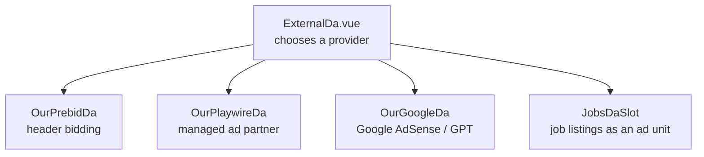

# Adverts

Freegle is free to use and free to join. It costs money to run. Adverts are one of the two
ways that money arrives, the other being [donations](donations-and-gift-aid.md). The two
are wired together, which is the most important thing on this page.

## Ads switch themselves off when members donate

A scheduled job, `donations:update-ads-target`
(`iznik-batch/app/Console/Commands/Donation/UpdateAdsTargetCommand.php`), compares
donations received in the last 24 hours against a target held in the `config` table
(`ads_off_target_max`). It writes back two values:

| Config key | Meaning |
|---|---|
| `ads_off_target` | How much is still needed today |
| `ads_enabled` | `0` once today's target is met, `1` otherwise |

So on a good day the site shows no adverts at all. When you are looking at production and
see no ads, that is very often the reason, not a bug. Check the `config` table before
debugging an ad provider.

## The component layout

Everything goes through one dispatcher.

Pages never embed a provider directly; they use `ExternalDa`. If you add a provider, add it
behind that dispatcher.

**Terms worth knowing.** *Header bidding* (Prebid) asks several advertisers to bid for the
space before the page asks Google to fill it, so the space sells for more. *GPT* is Google
Publisher Tag, Google's script for filling ad slots. *House ads* are our own content shown
when nothing sells.

## Behaviour that trips people up

- **Prebid has a 2 second bid timeout and a 31 second refresh.** A slot that appears to do
  nothing for half a minute is normal.
- **If GPT is blocked** (ad blocker, tracking protection) the components fall back after
  about a second rather than hanging. Most developers have a blocker installed, so the
  local experience is usually the fallback path, not the real one.
- **Playwire picks a unit type from the computed maximum height of the slot**, so a CSS
  change to a container can silently change which advert format is requested.
- **Slots must be destroyed on unmount.** The components call `destroySlots` /
  `destroyUnits` from both `onBeforeUnmount` and `onBeforeRouteLeave`, because
  `onBeforeUnmount` is not reliably called on route change. Leaked slots produce adverts
  that reappear on the wrong page.
- **Ad visibility logging is one-shot per slot** and is known to under-report on Safari and
  Firefox. Do not treat those counts as a measurement of what members saw.

## Rules

- Adverts must never appear in the moderator app (ModTools).
- Adverts must not be placed where they can be mistaken for a Freegle post.
- Provider ids are configuration (`GOOGLE_ADSENSE_ID`, `PLAYWIRE_PUB_ID`,
  `PLAYWIRE_WEBSITE_ID`), never hardcoded. See
  [external-services.md](external-services.md).
