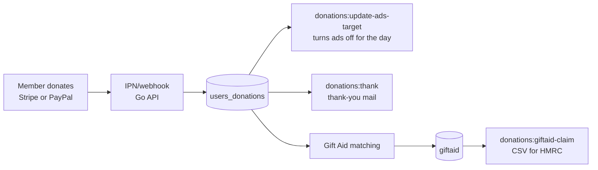

# Donations and Gift Aid

Freegle is a registered charity. Members donate; the charity claims Gift Aid on the
donations of UK taxpayers who have said it may. This page covers how money is taken,
recorded and claimed. It does not cover the charity's finances, which are not documented
in this repository.

**Gift Aid**, in plain terms: if a UK taxpayer donates and confirms they are a taxpayer,
the charity can claim back the basic-rate tax already paid on that money from HMRC, adding
25p to every pound at no cost to the donor. To claim it we need the donor's name and the
first line and postcode of their home address, and a declaration from them.

## Taking the money

| Route | Where the code is |
|---|---|
| Card, one-off | `iznik-server-go/donations/stripe.go` - `POST /stripecreateintent` |
| Card, monthly | `POST /stripecreatesubscription` |
| Confirmation from Stripe | `iznik-server-go/donations/stripeipn.go` - `POST /stripeipn` |
| PayPal | `iznik-server-go/donations/paypalipn.go`, plus a nightly reconciliation download (`PaypalDownloadService`) |

The Stripe webhook handles **`charge.succeeded` only**. That is deliberate and worth
knowing: other Stripe event types are ignored, so if a donation is missing from the
database, check which event Stripe actually sent before looking for a bug in our code.

Donations land in `users_donations`. Asks (the prompts we show) are recorded separately in
`users_donations_asks`, so how often we ask can be measured against what we raise. What
appears in email is described in
[donation-asks-in-email.md](donation-asks-in-email.md).

## The end-to-end picture

There is also a drawn overview of the donor journey:
[freegle-donor-process.svg](../../freegle-donor-process.svg).

## Gift Aid

`GiftAidClaimService` (`iznik-batch/app/Services/GiftAidClaimService.php`) does the work,
driven by `donations:giftaid-claim` and `donations:update-giftaid`.

- **`GIFT_AID_EARLIEST_DATE = '2016-04-06'`** - claims cannot reach back further than this,
  so any date arithmetic must clamp to it.
- `identifyPostcodes()` and `identifyHouseNumbers()` recover the address parts HMRC
  requires from what the member has already given us, falling back to saved addresses.
- `identifyGiftAidedDonations()` matches donations to declarations.
- `generateClaim()` writes the **CSV in HMRC's required format**. HMRC rejects the whole
  file on a formatting error, so it is generated, never hand-edited, and there is a
  `--dry-run`.
- `sendGiftAidChaseUps()` emails members who donated and have not yet made a declaration.
- `splitName()` exists because HMRC wants first and last name separately and members type
  a single name field. It is a heuristic; the `firstname`/`lastname` columns on `giftaid`
  were added so a corrected split can be stored.

Claims are submitted to HMRC by a person, not by this code. Who does that is in
[../../handover/05-who-does-what.md](../../handover/05-who-does-what.md).

## Thanking donors

`donations:thank` and `donations:thank-prep` send thank-you mail; `thanked` on
`users_donations` stops anyone being thanked twice. A separate daily summary
(`donations:summary`) reports the day's takings to the people who need to see it.

## Things to be careful about

- **Never test against live payment credentials.** Stripe and PayPal both have test modes.
- **`correctUserIdInDonations()` exists because donations can arrive without a matching
  member** (a donor pays from an address we do not know). Do not assume every row in
  `users_donations` has a valid `userid`.
- Some payers are deliberately excluded from the ads target calculation
  (`getExcludedPayersCondition`), so totals in the database and totals in that job will not
  always agree.
