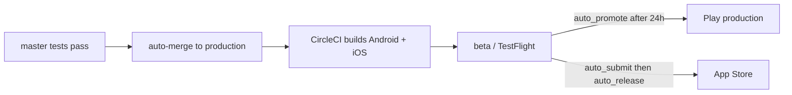

# Mobile apps

New to this and taking it on? Start with
[../../getting-started/mobile-track.md](../../getting-started/mobile-track.md), which is
the day 1, week 1, month 1 version of this page.

There are **two** strands of mobile work in this repository, and only one of them ships.
Getting this wrong wastes days, so it is the first thing on the page.

| | Ships to members | Where |
|---|---|---|
| **Capacitor build of the Nuxt site** | **Yes** - this is the Freegle app | `iznik-nuxt3/` (`capacitor.config.ts`, `android/`, `ios/`, `fastlane/`) |
| Kotlin Multiplatform native app | No - an experiment | `freegle-app/` |

There is also a `freegle-mobile/` directory on some machines. It is **not in git** and is
local scratch. Ignore it.

## The app that ships

Capacitor wraps the same Nuxt code that runs the website into native Android and iOS apps.
There is no separate app codebase: a fix to a Vue component fixes the website and both
apps.

**The manual is [`iznik-nuxt3/README-APP.md`](../../../iznik-nuxt3/README-APP.md)** - 1,200
lines covering build configuration, native plugins, push notifications, photo handling,
signing and release. This page is orientation only; go there to do the work.

Facts worth carrying in your head:

- Built from the **`production` branch**, the same branch Netlify deploys, so web and app
  ship the same code.
- `ISAPP=true` switches the build to static generation instead of server rendering.
- **Four store listings**, not two: Freegle and ModTools, each on Android and iOS.
  The member app is `org.ilovefreegle.direct` on Android; the iOS bundle id differs
  (`org.ilovefreegle.iphone`), selected in `capacitor.config.ts` by the `USE_COOKIES`
  environment variable.
- **Minimum OS** is Android 8.0 and iOS 15.0.
- Native plugins are on a **per-platform allowlist** (`includePlugins`) in
  `capacitor.config.ts`. A plugin that is installed but not listed is silently absent at
  runtime.
- The Android build **throws at config time** unless the four keystore variables are set
  (`FREEGLE_NUXT3_KEYSTORE_PATH`, `..._PASSWORD`, `..._ALIAS`, `FREEGLE_NUXT3_KEYALIAS_PASSWORD`).
  That is deliberate: an unsigned build is worse than no build.

## Releasing

Releases are automated with **fastlane** (`iznik-nuxt3/fastlane/Fastfile`), driven by
CircleCI jobs (`build-android`, `build-ios`, and the ModTools and debug variants). Android
builds run only on the `production` branch.



Lanes you will meet: `beta`, `promote_beta`, `auto_promote` (waits 24 hours before
promoting), `auto_submit` and `auto_release` for iOS review, `expire_test_versions` (the
99.x.x test builds), and `check_release_divergence`, which alerts when the live Play and
App Store versions have been different for over a week.

Two traps that have bitten before:

- **Google Play's target-API requirement spans every track.** A stale build sitting in the
  test track can block a production release. Expire old test versions.
- **The orb version is pinned deliberately.** In August 2026 it was rolled back because a
  newer version moved the Android executor to a machine size that is not in our plan. Check
  the comments in `.circleci/continue-config.yml` before bumping it.

App JavaScript is baked into the package at build time, so when a member reports an old
bug, check the build date in the app rather than assuming they have the current code.

## The Kotlin Multiplatform experiment

`freegle-app/` is a native app built with Kotlin Multiplatform (shared Kotlin logic,
Jetpack Compose UI on Android; the iOS side was never implemented). It was written to test
a different, more app-like experience: a "Daily 5" of curated items, a swipeable discovery
deck, streaks, and automatic device-based accounts with no sign-in step.

It is **not released and not on a path to release**. Treat it as a prototype and confirm
the current direction with the team before spending time on it. The design work, including
the competitor research behind it, is in `plans/active/freegle-mobile-app.md`.

To build and run it:

```bash
cd freegle-app
export ANDROID_HOME=/path/to/android-sdk   # needs Java 17+, platform 35
./gradlew assembleDebug
# APK at androidApp/build/outputs/apk/debug/androidApp-debug.apk
```

It talks to the same v2 Go API as everything else, configured in
`androidApp/build.gradle.kts`. Running it on a headless emulator:

```bash
ANDROID_HOME=~/android-sdk
$ANDROID_HOME/cmdline-tools/latest/bin/sdkmanager "emulator" "system-images;android-35;google_apis;x86_64"
sudo gpasswd -a $USER kvm            # hardware acceleration
echo "no" | $ANDROID_HOME/cmdline-tools/latest/bin/avdmanager create avd \
  -n freegle_test -k "system-images;android-35;google_apis;x86_64" -d pixel_6 --force
sg kvm -c "$ANDROID_HOME/emulator/emulator -avd freegle_test -no-window -no-audio -gpu swiftshader_indirect"
$ANDROID_HOME/platform-tools/adb install androidApp/build/outputs/apk/debug/androidApp-debug.apk
$ANDROID_HOME/platform-tools/adb shell am start -n org.freegle.app/.android.MainActivity
$ANDROID_HOME/platform-tools/adb exec-out screencap -p > screenshot.png
```

The seeded local database already has test data (FreeglePlayground, around Edinburgh).
