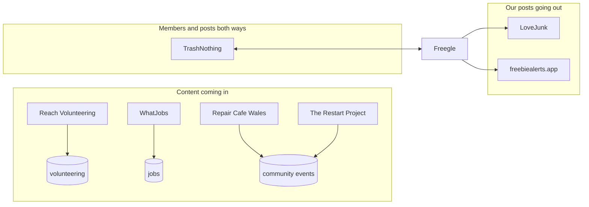

# Partner integrations

Freegle does not stand alone. Other reuse and volunteering organisations either send us
content, take our content, or both. This page is the inventory: who they are, which
direction the data flows, and what breaks.

Every one of these is **someone else's system**. When one stops working, the first question
is not "what did we change" but "what did they change".

## TrashNothing

By far the biggest and the most important. TrashNothing is a separate reuse site whose
members can use Freegle groups. Their members appear in our database as real members with
addresses at `*@user.trashnothing.com`, so a great deal of Freegle traffic is theirs.

Because it is large and long-standing it has its own page:
[trashnothing.md](trashnothing.md). Read that before touching anything that touches
posting, replying or member email, because a change that works for a Freegle member can
easily break for a TrashNothing one - their posts and replies arrive by **email**, not
through our website.

Config: `freegle.trashnothing_domain`, `freegle.trashnothing.api_base_url`.

## LoveJunk

LoveJunk is a paid-for junk collection marketplace. Freegle Offers are syndicated to it so
that an item nobody freegles has a route other than landfill; a member can accept a paid
collection quote.

- Command: `integrations:sync-lovejunk`
- Config: `freegle.lovejunk.api`, `freegle.lovejunk.secret`
- The syndication path is described in [trashnothing.md](trashnothing.md), since TN
  brokered it.

## freebiealerts.app

A third-party aggregator that alerts its users to free items. We push post events to it
rather than letting it poll us.

This one is **event-driven from the Go API**, not a scheduled sync. `iznik-server-go`
queues a background task when a post's state changes:

| Task | When |
|---|---|
| `freebie_alerts_add` | An Offer is approved and live |
| `freebie_alerts_remove` | The post is taken, withdrawn or deleted |

The tasks go into `background_tasks` (see `iznik-server-go/queue/queue.go`) and are
processed by the batch tier. Config: `freegle.freebie_alerts.api_url`
(`https://api.freebiealerts.app`) and `freegle.freebie_alerts.api_key`.

Because removal is a queued task, a post that has gone can briefly still be advertised
elsewhere. That is expected; if it persists, look at whether the queue is being drained.

## Reach Volunteering

Reach Volunteering lists volunteering opportunities for charities. We pull their
opportunities into our `volunteering` table so they appear alongside Freegle's own
volunteering listings.

- Command: `integrations:sync-reachvolunteering` (has `--dry-run`)
- Service: `ReachVolunteeringService`
- Config: `freegle.reach_volunteering.feed_url`, `username`, `password`,
  `fetch_attempts` (3), `retry_delay_seconds` (30)

**Known fragility, already handled in code:** their Drupal feed intermittently returns a
PHP fatal-error page (execution time exceeded) with an HTTP 200 status instead of JSON. The
service retries rather than treating that as an empty feed. If you are debugging, do not
trust the status code.

**Status:** the Freegle team's understanding is that this integration is being wound down
at Reach's end. Confirm with the team before investing effort in it - the code and the
scheduled sync are still live, so there is nothing in the repository that tells you it is
ending.

## WhatJobs

A job-listing feed, shown on Freegle as a small revenue stream (see
[ads.md](ads.md)).

- Command: `integrations:sync-whatjobs`, service `WhatJobsService`
- Config: `freegle.whatjobs.feed1`, `feed2`; geocoding via `freegle.geocoder`
- Monitoring: `freegle.monitoring.whatjobs_max_age_hours` (24) alerts if `jobs.seenat`
  stops advancing
- A feed file that will not open is logged as a warning and skipped, so one bad feed
  does not stop the other one

**The cautionary tale.** The geocoder URL was parameterised into an env var that
`.env.background` never set, so `geocodeAddress()` silently returned null and the live
`jobs` table sat at roughly 400 rows for months. Nothing failed loudly. When you move a
hardcoded value into configuration, check the environment that actually runs it.

Related: the `jobs` table doubles as the geocode cache, so a wrongly placed job never
heals itself.

## Repair Cafe Wales and The Restart Project

Both publish repair events, which we import as community events so members can find a
repair option instead of freegling a broken item.

- `integrations:sync-repaircafewales`
- `integrations:sync-restartproject`

**Duplicates in repair events are usually upstream.** The Restart Project publishes more
than one record per occurrence, so two identical events in our list is normally their data,
not our importer. Check the feed before writing de-duplication logic.

## Adding an integration

Follow the shape the existing ones use:

1. A **service** class holding the fetch and the mapping, with a `sync(bool $dryRun)`.
2. A **command** in `iznik-batch/app/Console/Commands/Integrations/` that takes a cache
   lock so two runs cannot overlap, supports `--dry-run`, and reports added/updated/deleted.
3. **Config in `iznik-batch/config/freegle.php`** reading from env, with the key added to
   `.env.background.example`. Never a hardcoded URL or key.
4. A **monitoring age check** so a feed that quietly stops is noticed, following
   `whatjobs_max_age_hours`.
5. A note on this page.
