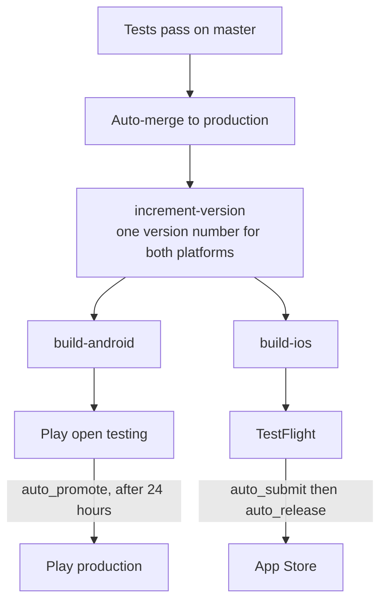

# Mobile developer: day 1, week 1, month 1

You are the person who now looks after the phone apps. This page is the order to do things
in. It stands on its own, but it assumes you can also do ordinary web development on the
site, because the apps **are** the site: see
[developer-track.md](developer-track.md) when you need that side.

**Read [what-freegle-is.md](what-freegle-is.md) first if you have not.** It is short, and
it defines the words used below.

## The one fact that changes everything

There is no separate app codebase. Capacitor takes the same Nuxt code that runs the
website, builds it as a static site, and wraps it in a native Android or iOS shell. A fix
to a Vue component fixes the website and both apps at once.

That has three consequences you will feel every week:

- **You cannot ship an app fix without shipping a website change**, because they are the
  same commit on the same branch.
- **The app-only problems are the native edges**: push notifications, the badge on the home
  screen icon, the camera, sharing, deep links, payments, social sign-in and the calendar.
  Those go through native plugins, and they break in ways the website never does.
- **There are four store listings, not two.** Freegle and ModTools, each on Android and
  iOS, all from this one repository.

The reference page is [../developers/reference/mobile-app.md](../developers/reference/mobile-app.md).
The manual, 1,200 lines of it, is
[`iznik-nuxt3/README-APP.md`](../../iznik-nuxt3/README-APP.md). This page is the order to
read them in, not a replacement.

## Day 1

### 1. Get your accounts

1Password first, because everything else is inside it. You need GitHub, the Google Play
Console, App Store Connect with an Apple developer account, Firebase (push notifications
run through it), and a normal member account on the live site. The list, and how to get
invited, is [accounts-and-access.md](accounts-and-access.md).

Apple in particular is slow to arrange, so ask on day 1 even though you will not need it
until week 2.

### 2. Install both apps and use them

Install Freegle from the Play Store and the App Store on a real device, sign in, post
something, reply to somebody. Then install ModTools if you have moderator rights.

Use the real thing before you build it. Half an hour here saves you from fixing the wrong
problem later, and it tells you what members actually see, which is not always what the
website shows.

### 3. Get the web stack running

The app is built from the web code, so you need the web code working first. Follow day 1
of [developer-track.md](developer-track.md#day-1). You do not need the whole stack running
to build an app, but you do need to be able to run the site.

### 4. Open the native projects

```
cd iznik-nuxt3
npm install
npx cap sync          # copies the built web code into android/ and ios/
npx cap open android  # opens Android Studio
npx cap open ios      # opens Xcode, on a Mac
```

`npx cap sync` is the step people forget. Editing a Vue file changes nothing in the native
project until you build and sync.

You need Android Studio for Android, and a Mac with Xcode for iOS. There is no way round
the Mac for iOS work.

## Week 1

### Get a build onto your own device

Android first, because it needs no Apple approval. Build a debug build from Android Studio
and install it over USB.

**The build refuses to start unless four keystore variables are set**
(`FREEGLE_NUXT3_KEYSTORE_PATH`, `FREEGLE_NUXT3_KEYSTORE_PASSWORD`,
`FREEGLE_NUXT3_KEYSTORE_ALIAS`, `FREEGLE_NUXT3_KEYALIAS_PASSWORD`). That is deliberate.
`capacitor.config.ts` throws rather than quietly producing an unsigned build that cannot be
installed or released. The values are in 1Password.

### Set up live reload, so you are not rebuilding all day

Rebuilding an app for every code change is unbearable. There is a separate **Freegle Dev**
app for this:

- Different package id (`org.ilovefreegle.dev`), so it sits alongside the real app on the
  same phone.
- It loads the web code from your machine over WiFi instead of from the bundle, with hot
  reload, so a saved file appears on the phone in a second or two.
- You only rebuild it when a Capacitor plugin changes, which is rarely.

Get the APK by triggering the `build-dev-app` job in CircleCI and downloading the artifact.
Then start the `freegle-dev-live` container from the status dashboard and point the phone
at your machine, either with `adb reverse` on ports 3004 and 24678 or over mDNS at
`freegle-app-dev.local`. The full setup, including the extra port forwarding WSL needs, is
under "Freegle Dev App (Live Reload)" in
[`README-APP.md`](../../iznik-nuxt3/README-APP.md).

One warning: `freegle-dev-live` talks to the **live production API**. You are looking at
real members' data, so be careful what you tap.

### Learn the plugin allowlist

`capacitor.config.ts` lists the native plugins to include, **per platform**, in
`includePlugins`. A plugin that is installed in `package.json` but missing from that list
is silently absent at runtime: no build error, no warning, just a feature that does nothing
on the device.

This has cost people days. When a native feature works on the website but not in the app,
check the allowlist before anything else.

### Ship something small, all the way out

Same rule as the web track: a typo, a small bug, one test, taken from your machine through
review and CI to members. The point is proving you can do it, not the change.

Two rules that are not negotiable, and they are in
[../developers/reference/coding-standards.md](../developers/reference/coding-standards.md):
never skip a test or make coverage optional, and never write off a failure as pre-existing.
And one about the humans: **only people merge pull requests.**

### Know why "it works for me" and "it is broken for them" can both be true

App JavaScript is baked into the package at build time. A member on a three month old
install is running three month old code, whatever you just deployed to the website. When
somebody reports a bug that you cannot reproduce, ask for the app version and build date
before you go looking in the code.

## Month 1

### Learn the release pipeline

You do not drive it by hand. It runs like this:



Things to know about it:

- **Both platforms share one version number**, calculated once by the `increment-version`
  job and passed to both builds, so Android and iOS never drift apart.
- **The build number comes from the stores**, not from the repository: Play is asked for the
  highest version code across every track, TestFlight for the highest build number. If a
  store API is unavailable, the build **fails** rather than guessing.
- **Android release builds only run on the `production` branch.**
- **ModTools ships separately**, on a weekly scheduled pipeline rather than with every
  Freegle release. It builds from the same native project with the package name rewritten,
  which is why keep rules in `proguard-rules.pro` must never name our own package: a rule
  naming the Freegle package would silently stop applying to ModTools.

The lanes themselves are fastlane (`iznik-nuxt3/fastlane/Fastfile`), and they are listed in
[../developers/reference/mobile-app.md](../developers/reference/mobile-app.md).

### Learn what the stores demand of you

The stores are the one part of this job with external deadlines you cannot negotiate.

- **Google Play's target-API requirement applies across every track.** A stale build sitting
  in a test track can block a production release. The `expire_test_versions` lane exists for
  this. Run it rather than wondering why an upload is rejected.
- **Play's technical quality thresholds** (code shrinking, memory, restoring sign-in without
  a tap) arrive during 2027 and cost store visibility if missed. Where we stand on each, and
  what is load-bearing in the configuration, is in
  [../developers/reference/play-technical-quality.md](../developers/reference/play-technical-quality.md).
- **The CircleCI orb version is pinned deliberately.** It was rolled back once because a
  newer version moved the Android build to a machine size that is not in our plan. Read the
  comments in `.circleci/continue-config.yml` before bumping it.
- **`check_release_divergence`** alerts when the live Play and App Store versions have been
  different for over a week. If it fires, one platform's release is stuck.

### Work through the native features

These are the parts that exist only in the app, and they are where your bugs will come
from. The test checklist lives in the comments at the top of `capacitor.config.ts` and
covers the status bar, camera, Google, Facebook and Apple sign-in, Stripe payments, push
notifications, the home screen badge, sharing, deep links, pinch zoom, the calendar and
device information.

Work through it on a real device on both platforms at least once, so you know what "working"
looks like before something breaks.

Push notifications are worth extra attention: they go through Firebase and a **Freegle fork**
of the Capacitor push plugin, pinned to a specific tarball in `package.json`. It is forked
for a reason, so do not swap it for the upstream plugin without finding out what the reason
was.

### Three things that will confuse you

- **`ISAPP=true` changes the build.** The app is a static site, not the server-rendered one
  the website uses. Anything relying on server rendering behaves differently, and some
  features are stripped from the app build to keep the download small.
- **`freegle-app/` is not the app.** It is a Kotlin Multiplatform prototype that has never
  shipped and is not on a path to shipping. If you find a `freegle-mobile/` directory, it is
  local scratch and not in git.
- **Names are historical.** `iznik-nuxt3/` runs Nuxt 4 and Capacitor 8. Do not try to make
  it consistent.

### Where to go deeper

| Subject | Page |
|---|---|
| Everything about the app build | [`iznik-nuxt3/README-APP.md`](../../iznik-nuxt3/README-APP.md) |
| Orientation and the release flow | [../developers/reference/mobile-app.md](../developers/reference/mobile-app.md) |
| Play technical quality | [../developers/reference/play-technical-quality.md](../developers/reference/play-technical-quality.md) |
| The web side of the same job | [developer-track.md](developer-track.md) |
| How CI and deployment work | [../ops/deployment-and-ci.md](../ops/deployment-and-ci.md) |
| Accounts and credentials | [accounts-and-access.md](accounts-and-access.md) |

### What "good" looks like after a month

You can take a bug reported by an app member, work out whether it is the shared web code or
a native edge, reproduce it on a device with live reload, fix it, and follow it through the
release pipeline into both stores without asking anybody how any of that works. Everything
else is depth.
