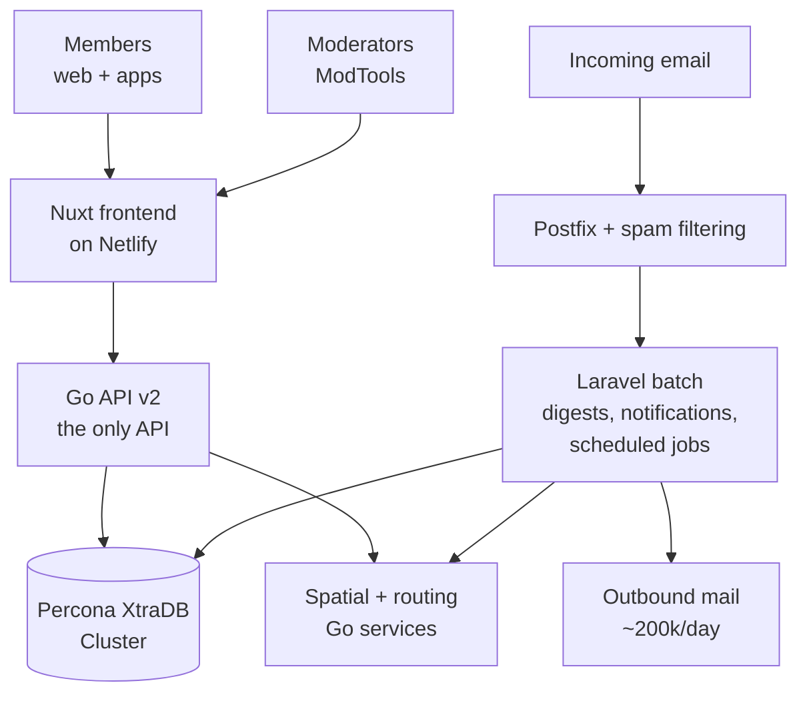

# What Freegle is

Read this first, whichever track you are on. Most of the technical decisions in this
platform only make sense once you know what the service is trying to do.

## The service in a paragraph

Freegle is a UK charity that runs a website and apps where people give away things they no
longer need, and ask for things they need, **for free, locally**. Someone posts a sofa;
people nearby reply; the two of them arrange collection in a private chat; the sofa is
collected instead of going to landfill. Nothing is sold, and there is no delivery. It is
made up of hundreds of local communities across the UK, and it is used by a few million
people.

Two consequences of that shape run through everything:

- **It is a local service, so geography is central.** Distance, travel time and community
  boundaries are first-class concepts, not a filter bolted on at the end. That is why there
  are dedicated spatial and routing services and a self-hosted geocoder.
- **It is free and charity-funded, so cost matters.** We self-host where it is cheaper and
  we can carry the operational burden. Adverts and donations pay for it, and there is a
  deliberate mechanism to turn the adverts off once donations have covered the day.

## Who uses it

| Who | What they use |
|---|---|
| **Members** | The website (`ilovefreegle.org`) and the mobile apps |
| **Moderators** | **ModTools** (`modtools.org`), a separate app for running a community. Volunteers, at least two per community |
| **Central volunteers** | ModTools plus their own tools, working across all communities rather than one |
| **Staff** | A very small paid team |

Almost everyone who runs Freegle is a **volunteer**. That shows up throughout the software:
moderation is designed to be quick and forgiving, email is the main way volunteers are
reached, and a change that increases moderator workload is a change that costs the charity
real volunteer goodwill.

The people, and who to ask about what, are in [who-does-what.md](who-does-what.md).

## The words we use

You will meet these constantly. They are Freegle's words, not industry standard.

| Word | Means |
|---|---|
| **OFFER** | A post giving something away. Shown to members as "Give" |
| **WANTED** | A post asking for something. Shown to members as "Ask" |
| **TAKEN** / **RECEIVED** | The outcomes: the giver marks TAKEN, the receiver marks RECEIVED |
| **Group** / **community** | A local Freegle community. `group` in the database, "community" to members |
| **Rippling out** | A post starts near the poster and reaches further away over time if nobody local takes it, so posters never choose an audience. See [../members/rippling-out.md](../members/rippling-out.md) |
| **Reach** | How far a post has travelled, expressed as travel time rather than miles |
| **ModTools** / **MT** | The moderator app. Same codebase, different site |
| **FD** | "Freegle Direct" - the member site. You will see `SITE: 'FD'` and `'MT'` in configuration |
| **Pending** | A post or member waiting for a moderator |
| **Held** | A post deliberately kept back, usually for a check |
| **Chat** | A private conversation between two members, or between a member and moderators. Always "chat", never "conversation" |
| **Digest** | The email of recent posts in a community |
| **Story** | A member's account of something they gave or got, used in newsletters |
| **TN** | TrashNothing, a separate reuse site whose members use Freegle communities. See [../developers/reference/trashnothing.md](../developers/reference/trashnothing.md) |
| **Iznik** | The name of this software. Historical; the repository is called Iznik, the service is called Freegle |

"Iznik" catches people out. If a directory, container or document says Iznik, it means
Freegle's own platform code.

## The moving parts

In one sentence each:

- **Nuxt frontend** (`iznik-nuxt3/`) - the member site, the moderator app, and, wrapped by
  Capacitor, the mobile apps. One codebase for all three.
- **Go API** (`iznik-server-go/`) - the only API. A PHP API used to exist and has been
  retired; if you find references to "v1", they are history.
- **Laravel batch** (`iznik-batch/`) - everything that happens on a schedule or in the
  background, and the owner of the database schema through its migrations.
- **Spatial and routing** (`iznik-spatial-go/`, `iznik-routing-go/`) - which community
  covers a point, how long it takes to drive somewhere, and how far a post should reach.
- **Mail** - both directions. A large amount of Freegle happens over email, including all
  TrashNothing traffic.
- **Database** - one Percona XtraDB Cluster (three nodes), with reads and writes routed
  differently.

It is a **monorepo**: all of those live in this one repository, versioned together.

The full component map is in
[../developers/architecture.md](../developers/architecture.md); the production
picture is in [../ops/production.md](../ops/production.md); why it is arranged this way is
in [decisions-and-rationale.md](decisions-and-rationale.md).

## How money works

Freegle is free to members and always will be. Income is adverts and donations, and the two
are connected: a scheduled job turns adverts **off** once the day's donation target is met.
So an advert-free site is often a good day, not a bug. See
[../developers/reference/ads.md](../developers/reference/ads.md) and
[../developers/reference/donations-and-gift-aid.md](../developers/reference/donations-and-gift-aid.md).

## What "broken" means here

Worth calibrating early, because it sets your priorities.

| Severity | Example |
|---|---|
| **Emergency** | The database cluster is unhealthy; mail has stopped flowing; the site is down |
| **Serious** | Members cannot sign in; posts are not reaching anyone; the moderation queue is invisible |
| **Annoying** | An advert slot is empty; a digest went out late; a map tile is missing |

Mail stopping is an emergency and is easy to miss, because a mail system that has stopped
delivering looks exactly like a quiet day. Yahoo-family delivery once failed for weeks
without an alert firing. The gaps in what alerts you are listed honestly in
[../ops/reference/sysadmin-duties.md](../ops/reference/sysadmin-duties.md).
