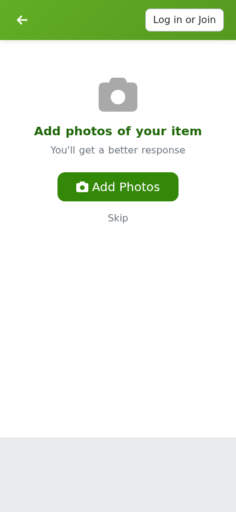

# Giving something away

Giving something away on Freegle takes a couple of minutes. You post an **OFFER**, people
reply, you pick someone, and they collect. This guide walks through the whole thing.

## Posting an OFFER

1. Click **Give** (`/give`), or the **+** button in the app.
2. **Describe the item.** Give it a clear name (for example "Child's blue bicycle") and a
   short description. You can add one or more **photos**. On the app you can take a photo
   there and then, and Freegle can suggest a name from the picture.
3. **Say where it is.** Enter your postcode. Freegle works out the local community for
   you from the postcode, so there is no group to choose. If no community covers that
   postcode, you will see a note asking you to get in touch.
4. **Set the options.** Choose whether you could deliver or it is collection only, and
   optionally set a deadline.
5. **Confirm who you are.** If you are logged in this is filled in already. If not, enter
   your email. If that email already belongs to an account, we ask you to log in rather
   than create a duplicate.
6. Click **Freegle it!** Your post goes live and starts reaching people nearby.

On a phone the steps are the same but split into photo, details, options and location
screens.

### Tips for a good OFFER

- A clear photo gets far more interest than none.
- Be honest about condition. "Well used but working" saves everyone time.
- Do not put your address or phone number in the description. You share those privately in
  the chat once you have chosen someone. Freegle warns you if your text looks like it
  contains personal information.

## Giving away a lot of things at once

If you are clearing a house, office or garage, use the **bulk clearance** post
(`/give/clearance`). You give an overall title and then list the individual items in one
post, instead of making dozens of separate ones. You can then manage who gets what from a
single dashboard.

## Replies and choosing someone

When people are interested they reply, and each reply starts a private **chat** with you.
You will get a notification and can see all your posts and their replies under **My
Posts** (`/myposts`).

From My Posts, or from the post itself, you can:

- **Promise** the item to a particular person, so others know it is spoken for. If it
  falls through, you can undo this ("renege") and offer it to someone else.
- **Edit** the post if you got a detail wrong.
- **Edit and resend** to freshen it up.
- **Repost** to bump it back to the top.

Freegle is first come, not an auction. It is good manners to reply to everyone, even if
just to say it has gone.

## When it is gone: marking it TAKEN

When someone has collected the item, mark your OFFER as **TAKEN**. This closes the post so
you stop getting replies, and lets you thank and rate the person who collected.

- Go to **My Posts**, open the post, and choose **Mark as TAKEN**.
- You can also do this from the "What happened to ..." email we send you.

If nobody took it and you no longer want to offer it, choose **Withdraw** instead.

## Reminders and auto-reposting

If your item is still available after a while, Freegle reminds you before it
automatically reposts it ("Will Repost: ..."), and later checks in to ask what happened
("What happened to: ..."). You only ever get one reminder and one check-in per item, even
if it has rippled out to several communities. Whatever you choose - taken, withdrawn, or
promised - applies everywhere the post has reached.

You can turn auto-reposting on or off in [your account settings](04-your-account.md).

## Next steps

- Looking for something yourself? See [Getting something](03-getting.md).
- Manage your emails, communities and profile in [Your account](04-your-account.md).
