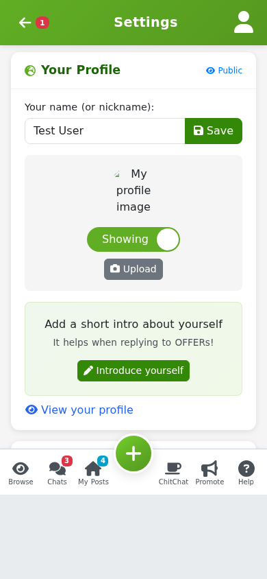

# Your account

Everything about how Freegle works for you lives on the **Settings** page (`/settings`).
This guide covers the parts you are most likely to want.

## Email and notifications

This is the setting people ask about most. You control how much Freegle emails you, per
community.

- **Simple mode** gives you one "Email level" (Off, Basic or Standard) plus how often you
  want to hear about new OFFERs and WANTEDs.
- **Advanced mode** ("Show advanced settings") lets you set, for each community you belong
  to, how often you get new-post emails, and toggle things like:
  - replies to your own posts,
  - a copy of messages you send,
  - ChitChat and notifications,
  - Freegle's messages about your posts,
  - suggested posts,
  - newsletters and stories,
  - encouragement emails.

**Freegle's messages about your posts** are the ones Freegle itself sends you in Chat when a
post has been up a while with no replies: whether you could deliver it, whether you need it
gone by a date, and how many people have looked at it. They come with buttons, so answering
takes one tap and updates your post. They are on by default and can be turned off here.

You can set each community to **immediate**, **daily digest**, or **no emails**. If you
turn emails right down, Freegle warns you to check your Chats regularly so you do not miss
a reply.

There is also a weekly **Community Event Roundup** email (sent Thursdays) listing local
events. It is on by default and can be turned off in Settings.

If you are in the app, you can also turn on a **daily push notification** of new posts.

Above the email settings there is a **Feed** section with a "How far away" slider, marked
Nearer at one end and Further at the other. It changes both what you see when browsing and
what we email you about. How far "Further" actually reaches depends on how spread out
freeglers are around your postcode, so it goes further in the countryside than in a city -
[rippling out](rippling-out.md) explains why.

## Your communities

You can belong to as many local communities as you like. It is best to stick to ones near
where you live or visit, because that is where you can realistically give and collect.
Joining a great many communities can flag your account for a routine review by
moderators, so there is no benefit to joining everywhere.

- Each community has its own email frequency, set in Email settings above.
- To **leave** a community, use **Unsubscribe** (`/unsubscribe`) and pick the community.
  Leaving stops its posts reaching you.

## The Unsubscribe link in our emails

Most email apps show an **Unsubscribe** link at the top of, or inside, our emails. Clicking
it turns off **the kind of email you were reading** — so unsubscribing from a What's New
digest stops digests, and nothing else. It does not delete your account.

Because of that, you may still get other kinds of email from us: chat messages, newsletters
and so on. We will send you a note saying what we turned off and what is still switched on.
You can change any of it, or turn everything off, on the Settings page.

## Your profile and ratings

- Set a **display name** and, if you like, a **profile photo** (or hide it).
- Write an **About Me** so people you freegle with know a little about you. Freegle will
  occasionally prompt you to add or refresh this.
- Other members can leave you **ratings** (a thank-you and thumbs up or down) on your
  public profile at `/profile/<id>`. Being reliable and polite keeps your ratings good,
  which helps people choose to give to you.

## Your posts

**My Posts** (`/myposts`) is the home for everything you have offered or asked for, active
and old. From here you edit, repost, promise, and mark items TAKEN or RECEIVED. See
[Giving something away](02-giving.md) and [Getting something](03-getting.md).

Note that old posts stay in your history and cannot be deleted. They are kept for
community statistics and so you always have a record of what you gave or received.

## Account and privacy

- **Change your email or password**, add a second email, or update your home postcode
  under Account settings. If Freegle cannot deliver to your email (it is "bouncing") you
  will see a warning and can fix it here.
- **Address book**: save one or more addresses to share quickly in chat when arranging
  collection.
- **Download your data** (`/mydata`): see everything Freegle holds about you and download
  it, for your right to access your data.
- **Duplicate accounts**: if Freegle spots two accounts that look like the same person, it
  offers to **merge** them (`/merge`), and you choose which email to keep.
- **Deactivate or delete**: you can permanently delete your account from **Unsubscribe**
  (`/unsubscribe`). This is permanent. If you are logged out, enter your email and confirm
  from the link we send you.
- **If you stop using Freegle**: after six months without a visit your account goes
  dormant and we stop emailing you. We do not remove member data for inactivity, so your
  posting history stays intact and you can pick up where you left off just by logging back
  in. Accounts that signed up but never joined a community do have their personal data
  removed automatically after six months. See
  [/privacy](https://www.ilovefreegle.org/privacy) for the full policy.

## More things members do

- **ChitChat** (`/chitchat`): a community discussion feed, separate from OFFER and WANTED
  posts. Chat about local goings-on, ask for recommendations, and so on. If a ChitChat
  post looks like an item request, Freegle nudges you to use Give or Ask instead.
- **Stories** (`/stories`): share why you freegle. Good stories may feature in a
  community newsletter.
- **Community events** (`/communityevents`) and **volunteering** (`/volunteerings`):
  browse and add local events and volunteering opportunities.
- **Invite a friend** (`/promote`): invite someone by email, or print a poster.
- **The app** (`/mobile`): the Freegle app does everything the site does, plus native
  camera, push notifications and calendar integration.

## Next steps

- New here? Start with [Getting started](01-getting-started.md).
- The moderators who run your community have their own guide under
  [../moderators/](../moderators/README.md).
