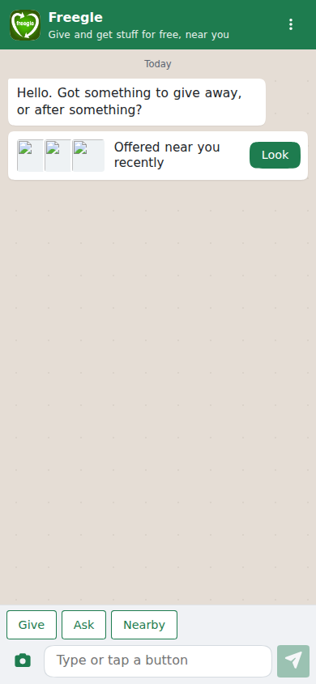
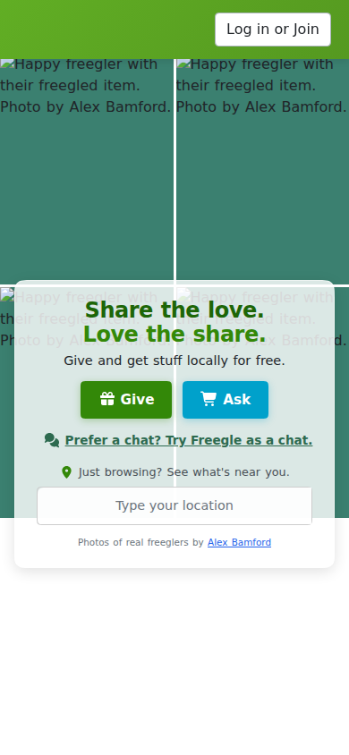
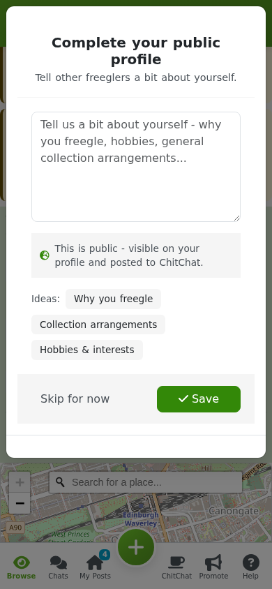

# Getting started

This guide gets you from never having used Freegle to browsing your local community and
ready to give or get your first item.

## Chat or website

Freegle comes in two shapes, and you can switch between them whenever you like.

**The chat.** Open [ilovefreegle.org](https://www.ilovefreegle.org) and you land in a chat
with Freegle, laid out like a messaging app. Tap **Give**, **Ask** or **Nearby** under the
chat, or just type what you want to do, and Freegle asks you one thing at a time. Your
chat list holds the chat with Freegle, **Your posts** (everything about what you have
offered or asked for), your chats with other freeglers, and your local **ChitChat**. On a
computer the chat sits in a phone-sized window in the middle of the page.

**The website.** The pages the rest of this guide describes, with a Browse page, a Give
page, a My Posts page and so on. Choose **Classic Freegle** from the menu at the top of the
chat to use it, and **Freegle chat** from the website's menu, or the link on its front
page, to come back. Freegle remembers your choice, on your account if you are signed in
and otherwise in your browser.

Everything you can do on the website you can do in the chat, and the two share the same
posts, chats and account. This guide describes the website, and says where the chat does
something differently.

## Creating an account

You can start browsing and even start a post without an account, but you need one to
reply to posts and to keep track of what you have given and received.

To sign up:

1. Go to [ilovefreegle.org](https://www.ilovefreegle.org) or open the app.
2. Click **Give** or **Ask**, or the **Join** button in the login box.
3. Sign up with your name, email and a password, or use **Continue with Facebook**,
   **Google**, or **Apple** (Apple is offered in the iOS app).
4. If you signed up with email, check your inbox and confirm your address so we can email
   you replies.

Already have an account? Choose **Log in** in the same box. Forgotten your password? Use
the "forgotten password" link and we will email you a link to get back in.

## Finding and joining your local community

Freegle is made up of hundreds of local communities across the UK. You can belong to as
many as you like, but most people start with the one covering where they live.

1. Go to **Explore** (`/explore`).
2. Search for your town or postcode, or browse the map.
3. Open the community that covers your area and click **Join community**.

You do not always have to join a community to use it. When you post, Freegle works out
the right community from the postcode you give, and joins you automatically if needed.

## Browsing what is on offer

Once you are logged in, **Browse** is your home page. It shows OFFERs and WANTEDs near
you, on a map and as a list.

- Use the **search box** to look for a particular item.
- Use the **filters** to show just OFFERs or just WANTEDs, to sort by "New to you" or
  "Closest", and to set how far away posts can come from.
- Click any post to see the detail and, if it is an OFFER you want, to reply.

Freegle remembers your filters between visits, so you only set them once.

## How "rippling out" works

You do not choose who sees your post, and you do not need to. Freegle shows every post to
people close by first, then gradually widens the area over time if nobody nearby takes
the item. This keeps freegling local: your neighbours get first chance, which means less
driving for everyone.

What this means for you as a member:

- **When you post**, you do not pick a community. Your post reflects where the item
  actually is, based on your postcode, and reaches the right people automatically.
- **On Browse**, the "Nearby" view shows posts that have reached your area, closest and
  most relevant first, rather than simply newest.
- **You can always reply** to a post you can see. If a post has not quite reached your
  area yet, we hold your reply and pass it to the owner the moment it does. Your message
  shows as "waiting to send" until then, and nothing is lost.
- If you would rather see only very local posts, drag the **"Nearer / Further"** slider
  in the filters (or in Settings) towards "Nearer".

There is a fuller explanation for members in
[./rippling-out.md](./rippling-out.md).

## Next steps

- Ready to give something away? See [Giving something away](giving.md).
- Looking for something? See [Getting something](getting.md).
- Want to control your emails and communities? See [Your account](your-account.md).
