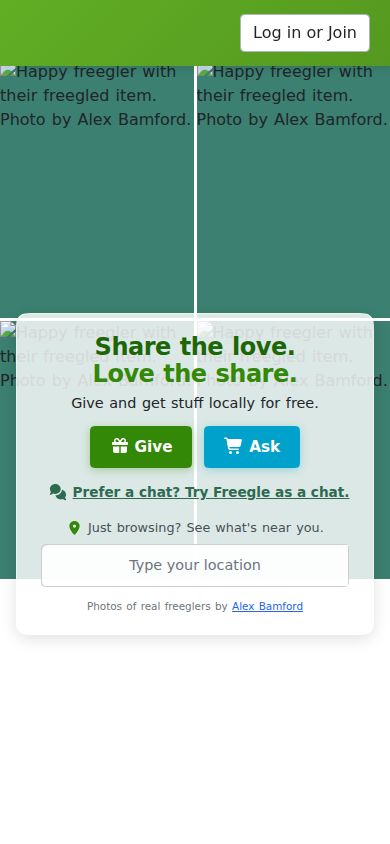
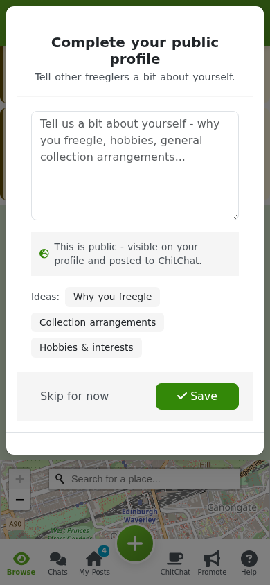

# Getting started

This guide gets you from never having used Freegle to browsing what is nearby and ready
to give or get your first item.

## Creating an account

You can start browsing and even start a post without an account, but you need one to
reply to posts and to keep track of what you have given and received.

To sign up:

1. Go to [ilovefreegle.org](https://www.ilovefreegle.org) or open the app.
2. Click **Give** or **Ask**, or the **Join** button in the login box.
3. Sign up with your name, email and a password, or use **Continue with Facebook**,
   **Google**, or **Apple** (Apple is offered in the iOS app).
4. If you signed up with email, check your inbox and confirm your address so we can email
   you replies.

Already have an account? Choose **Log in** in the same box. Forgotten your password? Use
the "forgotten password" link and we will email you a link to get back in.

There is nothing to join and nowhere to pick from. Freegle is one national service, and
your account is all you need - what you see and who sees your posts is worked out from
distance, not from membership of anything.

## Browsing what is on offer

Once you are logged in, **Browse** is your home page. It shows OFFERs and WANTEDs near
you, on a map and as a list.

- Use the **search box** to look for a particular item.
- Use the **filters** to show just OFFERs or just WANTEDs, to sort by "New to you" or
  "Closest", and to set how far away posts can come from.
- Click any post to see the detail and, if it is an OFFER you want, to reply.

Freegle remembers your filters between visits, so you only set them once.

## How "rippling out" works

You do not choose who sees your post, and you do not need to. Freegle shows every post to
people close by first, then gradually widens the area over time if nobody nearby takes
the item. This keeps freegling local: your neighbours get first chance, which means less
driving for everyone.

What this means for you as a member:

- **When you post**, your post reflects where the item actually is, based on your
  postcode, and reaches the right people automatically. You do not pick where it goes.
- **On Browse**, the "Nearby" view shows posts that have reached your area, closest and
  most relevant first, rather than simply newest.
- **You can always reply** to a post you can see. If a post has not quite reached your
  area yet, we hold your reply and pass it to the owner the moment it does. Your message
  shows as "waiting to send" until then, and nothing is lost.
- If you would rather see only very local posts, drag the **"Nearer / Further"** slider
  in the filters (or in Settings) towards "Nearer".

There is a fuller explanation for members in
[./rippling-out.md](./rippling-out.md).

## A few ground rules

The full rules are one page, the same for everyone: `/rules`. Everything on Freegle is
free, only legal items are allowed, and personal details stay out of posts. See
[Getting something](getting.md#a-few-ground-rules) for the short version.

## Next steps

- Ready to give something away? See [Giving something away](giving.md).
- Looking for something? See [Getting something](getting.md).
- Want to control your emails? See [Your account](your-account.md).
