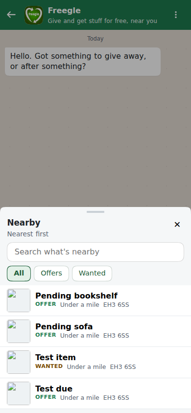
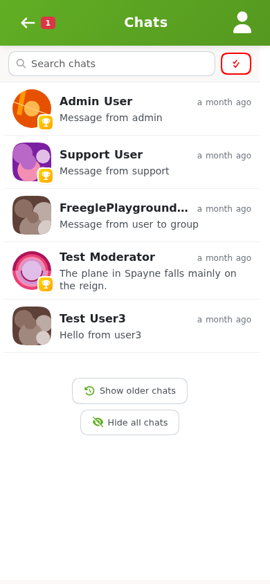

# Getting something

There are two ways to get something on Freegle: reply to an **OFFER** that someone has
posted, or post a **WANTED** describing what you are looking for. Often you will do both.

## Replying to an OFFER

1. On **Browse**, find an OFFER you want. Set the filter to "Just OFFERs" if that helps.
2. Open the post and write a short, friendly reply saying why you would like the item and
   when you could collect.
3. Send it. This starts a private **chat** with the person offering.

Replies go **privately** to the person offering, not onto the community board. That keeps
the board readable when a popular item gets lots of replies. Say a little about yourself:
offers are not first come first served, and many people like to give to whoever will make
good use of the item.

If a post has not quite reached your area yet (this can happen if you have widened your
view beyond "Nearby"), you can still reply. Freegle holds your message for a while so that
people closer to the item get first go, then passes it on. Before you send, the site tells
you when: either when the post is due to reach your area, or, if it is never going to
spread quite that far, when it stops spreading and your reply goes anyway. It shows as
"waiting to send" until it has gone.

### Finding and replying in the chat

In the chat, tap **Nearby** under the chat and a sheet slides up over it: a search box, an
Offers or Wanted filter, and what is nearest to you, one line each. It scrolls inside the
sheet, ten more at a time, so the chat underneath stays where it was. Tap a line to read
more and see the photo, and **Reply** to start a chat with the person giving it away. If
you type what you are after instead, Freegle says how many it found and shows a glimpse
of three; **Look** opens the same sheet. Your chats with other freeglers sit in the same
list as your chat with Freegle, and arranging collection works exactly as described below.

## Posting a WANTED

If nobody is offering what you need, post a WANTED and let it find you.

1. Click **Ask** (`/ask`), or the **+** button in the app.
2. Describe what you are looking for, and add a photo if it helps.
3. Enter your postcode. As with an OFFER, Freegle works out your local community for you.
4. Confirm your email if you are not logged in, then click **Freegle it!**

A WANTED has no delivery or deadline step. People who have the item can reply to you.

In the chat, tap **Ask** and answer Freegle's questions in turn: what you are looking
for, a word about why or what would do, your postcode, and your email if you are not
signed in. Before posting, Freegle looks for matching offers nearby and shows any it finds,
so you may not need to post at all. Tap **Carry on asking** to post anyway. Replies come to
**Your posts**, and people offering you the item appear there with a **Reply** button.

## The chat: arranging collection

Everything after the first reply happens in the **chat** (`/chats`).

- **Agree a time and place** to collect, in your own words.
- **Share an address** privately using the address button, so the other person knows
  where to come. You can save addresses in your [account settings](your-account.md) for
  next time.
- Send photos in the chat if you need to.
- Freegle may nudge the person offering to check whether they have had a reply, and to
  chase up no-shows, so conversations do not go cold.

If the person offering **promises** the item to you, you will see a "promised to you"
banner in the chat.

### Staying safe

- Arrange collection somewhere you are comfortable, and tell someone where you are going.
- Keep the conversation in the Freegle chat until you are ready to share contact details.
- You can **report** a chat or a post to the moderators, or **block** someone, from within
  the chat if anything feels wrong. Blocking hides the conversation and stops their messages
  and nudges reaching you, and withdraws any promise you had made them. It stays in place,
  even if you open the conversation to look at it, until you choose **Unblock**.

## When you have it: marking it RECEIVED

If you posted a WANTED and got the item, mark your post as **RECEIVED**. This closes it
and lets you thank and rate the person who helped. Open the post under **My Posts** and
choose **Mark as RECEIVED**, or use the link in the "What happened to ..." email.

(When you collect an item from someone else's OFFER, it is *they* who mark their post
TAKEN. You do not need to do anything, though a thank-you in the chat is always welcome.)

## A few ground rules

- **Everything is free.** Do not offer or ask for payment, and do not swap item for item.
  Freegle is about giving, not trading.
- **Only legal items.** If something cannot legally be given away, it is not for Freegle.
- **Some items come with safety guidance.** Things like car seats, cycle helmets and cot
  mattresses can be freegled, but check the guidance a moderator may attach to the post,
  and use your judgement.
- **Do not use auto-responders.** Automatically replying to lots of posts looks like spam
  and can get your account removed. Going away? Pause your Freegle emails in Settings
  instead.

## Next steps

- Want to give something back? See [Giving something away](giving.md).
- Manage your emails, communities and profile in [Your account](your-account.md).
