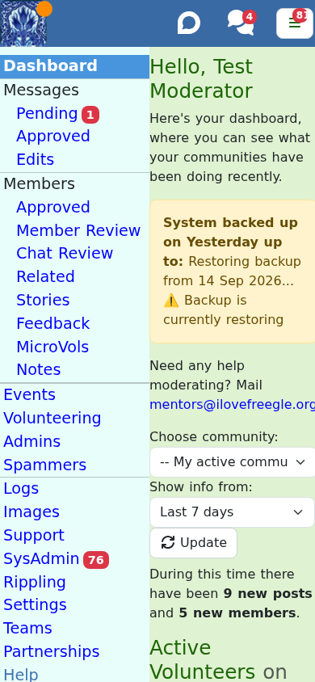

# Getting started as a moderator

## Getting into ModTools

ModTools lives at [modtools.org](https://modtools.org) and has its own app. It is a
separate application from the main Freegle site, but you log in with the same account.

- Go to modtools.org and log in. If you are not signed in, a login box opens
  automatically.
- You will only see moderation features for the communities you actually moderate.
- Support sometimes sends a one-click link that logs you straight into a specific member
  or community for help; that is what the `/login` page handles.

## The dashboard

The dashboard (the ModTools home page) is your daily starting point.

It shows:

- a greeting and the current app versions,
- highlights from the volunteers' Discourse forum, and nudges if your community is missing
  rules or you are missing a profile,
- a community picker and a date range, then
- statistics: recent activity counts, active moderators, popular posts, top posters and
  repliers, and your community's impact (weight and CO2 diverted), with an activity graph.

The **red badges** next to the menu items are your work list: pending posts, chat review,
spam reports, stories and so on. They update automatically, so the numbers tell you where
attention is needed.

## Roles and permissions

Freegle has two independent kinds of role. It helps to know which is which.

**Your role on a community** (set per community):

- **Member** - an ordinary member.
- **Moderator** - can moderate that community.
- **Owner** - full responsibility for the community: can add and remove other volunteers
  and controls the membership list. Every community must have at least two owners.

**Your system-wide role** (across all of Freegle):

- **User**, then **Moderator**, then **Support**, then **Admin**. Support and Admin unlock
  the support and sysadmin tools (see
  [running your community](04-running-your-community.md)).

On top of that, some features are gated by specific **permissions** (for example
Newsletter, Spam admin, Gift Aid, Clearance), granted independently of your role. If you
cannot see a feature this guide mentions, you may not have that permission on that
community yet.

You can see Freegle's volunteer **teams** and who is on them under `/teams`.

## Switching between communities

Almost every list and queue has a **community picker** at the top. Use it to work on:

- **All my communities** at once,
- a **single community**, or
- **all Freegle communities** system-wide (Admins only).

Your choice is remembered per page and reflected in the URL, so you can bookmark or share
a link to exactly the view you want.

## Your personal settings

Under **Settings** there is a **Personal** tab for your own preferences as a moderator:
for example whether to get ChitChat email, and your notification and beep preferences.
This is separate from a community's settings, which are covered in
[running your community](04-running-your-community.md).

## Talking to other moderators

The **Us** link in ModTools signs you into the volunteers' **Discourse** forum, where
moderators discuss issues, share advice and keep up with Freegle-wide news. For anything
urgent, `mentors@ilovefreegle.org` reaches experienced volunteers who can help.

## Next steps

- The core of the job: [Moderating posts](02-moderating-posts.md).
- Looking after people: [Managing members](03-managing-members.md).
- Configuring things: [Running your community](04-running-your-community.md).
