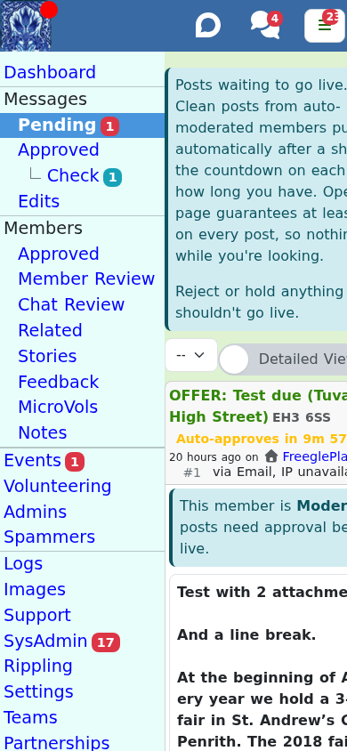

# Moderating posts

Approving and tidying members' posts is the heart of moderation. This guide covers the
queues, the actions, why posts get held, and how reports work.

## The pending queue

**Messages > Pending** (`/messages/pending`) is where posts waiting for a decision
appear, for the community (or all your communities) you have selected.

The dropdown at the top of the page remembers what you picked, on that browser, and
applies it again next time. The **Pending** count in the menu, on the other hand, counts
posts across every community you moderate. So the two can disagree: if the community you
picked is quiet, the page is empty while the menu still shows a count. When that happens
the page says so, names the community it is filtered to, and offers a button to go back
to all your communities, which also clears the remembered choice.

For each post you can:

- **Approve** it, so it goes live and reaches members.
- **Reject** it, with a friendly standard message explaining why.
- **Edit** it inline - fix the subject, description, item, location, photos or post type,
  or move it to another community. For a well-formed OFFER or WANTED, editing the item and
  location rebuilds the subject automatically.
- **Hold** it, which locks it to you so another moderator does not act on it at the same
  time. Release it when you are done. The lock is enforced: while you hold a post, another
  moderator who tries to approve, reject, delete or spam it is told you are holding it and
  the action does not happen. If they need to act anyway - say you are away - they can
  **Release** it first, which is always allowed.

  A hold applies to **your community's copy of the post, not the post everywhere**. A post
  that has rippled out to neighbouring communities has a separate copy on each, and each
  community moderates its own: holding it on yours does not lock, hide the buttons for, or
  remove from anyone else's pending count the copy on theirs. If you moderate several
  communities the same post reached, you will see it held only on the one where the hold
  was placed.
- **Delete** or **Delete as Spam** (on your own community's posts).

If a post only breaks a small rule, prefer **editing it with a note** over rejecting it.
Reject only for the core rules: a post must be **free** and **legal**.

Posts left unmoderated auto-approve after a period (historically around 48 hours) so a
community keeps running through gaps in cover. You can put reliably well-behaved members
onto immediate posting so their posts do not queue at all (see below).

## Why a post is held or flagged

ModTools tells you *why* a post needs a look, right on the post:

- **Automated spam checks** add a reason explaining a likely problem.
- **Worry words** flag posts mentioning regulated, reportable or otherwise sensitive
  content, or specific keywords, so you can check them.
- **The member's posting status.** A member can be **Moderated** (every post needs
  approval - typical for new or flagged members) or **blocked from posting**. A moderated
  member's posts arrive here; a blocked member's Approve button is disabled.
- **Duplicate and cross-post detection** warns when the same subject was posted recently,
  or appears on another community.
- **Rippling banners** explain when a post has rippled in from a neighbouring community
  ("do not reject just for being out of area"), or has rippled out to several communities
  (so approving here affects only your community). A **View rippling reach** map shows
  where the post is or will be visible. The map is the post's full reach; an individual
  member inside it still only sees the post if it is within the travel time their own
  area justifies, which is further in the countryside than in a city - so "it is on the
  reach map" and "everyone in that area saw it" are not the same thing. See
  [rippling out](rippling-out.md).
- **Bulk clearance** posts show an item count and a "see how members see it" preview.

## Standard messages

Most actions send a **standard message** - a canned, editable reply for a common
situation (approve, reject, hold, and so on). You configure your sets under Settings (see
[running your community](04-running-your-community.md)). Each action can be marked:

- **rarely used**, so it hides behind a "more" expander, and
- **autosend**, so one click sends it, versus opening it for editing first. You can flip
  between "autosend" and "edit first" for a session.

Keep them friendly and personal. A short human note lands far better than a corporate one.

### Fill-in boxes and optional bits

A standard message can mark parts of its wording with `<editthis>...</editthis>` (something
you must write yourself each time) or `<optional>...</optional>` (something that only
applies sometimes). You add those tags when you write the message under Settings.

When a message uses either of them, sending it opens the message laid out in order rather
than as one block of text:

- An **`<editthis>`** part is a highlighted box. Fill it in before you send.
- An **`<optional>`** part comes with **Keep** and **Remove**. You must choose one, and you
  can change your mind afterwards either way. The wording itself stays editable, so you can
  reword it as well as take it or leave it.
- The rest of the wording is editable too.
- Between the parts you will see whether there is a **blank line between these paragraphs**,
  with a click to add or remove one. That is what controls the spacing the member sees, so
  if a message arrives with its paragraphs run together, this is where you fix it.

If something is still outstanding, sending is refused: nothing goes to the member, the
outstanding boxes are outlined in red, and the message tells you what is left to do.

## The edit queue

Members can suggest edits to their own posts. **Messages > Edits** (`/messages/edits`)
shows these with an old-to-new difference, and you **Accept Edit** or **Reject Edit**.

## Approved posts

**Messages > Approved** (`/messages/approved`) lets you browse posts that are already
live, search by id, subject or member, and mark OFFERs and WANTEDs as **Taken**,
**Received** or **Withdrawn** on the member's behalf when needed. You can also move a post
**Back to Pending** for another look.

## Marking as spam versus deleting

If a post really is spam, use **Delete as Spam** rather than a plain delete. Marking it as
spam feeds Freegle's spam filters so similar posts are caught in future; a plain delete
does not. You can also **Report Spammer** straight from a post - see
[managing members](03-managing-members.md).

## Reports and "Back to Pending" across communities

A post can be pulled back for review in two ways, and with rippling they behave
network-wide:

- **Members reporting** a post is a review vote. When two different members flag the same
  post, it moves back to Pending on **every** community it is on, is hidden from members,
  and stops rippling while under review. Each community's moderators then decide on their
  own copy.
- **A moderator reporting**, or moving a post **Back to Pending** in ModTools, counts on
  its own - no quorum needed - and pulls the post to Pending everywhere it has reached.

In all these cases the copies are **kept**, each community decides independently, and
re-approving a copy does **not** re-notify members or re-ripple from scratch. Rejecting a
rippled-in copy simply removes it from your community; the poster is not told, and other
communities are unaffected. There is a full walk-through in
[./rippling-out.md](./rippling-out.md).

When a post reappears in your Pending queue this way - even one you had already approved -
the pending post now shows the reason (for example *"A moderator moved this post back to
pending for review."*), so you can see why it is back rather than assuming your Approve did
not work.

## Next steps

- Looking after the people behind the posts: [Managing members](03-managing-members.md).
- Configuring queues, rules and standard messages:
  [Running your community](04-running-your-community.md).
