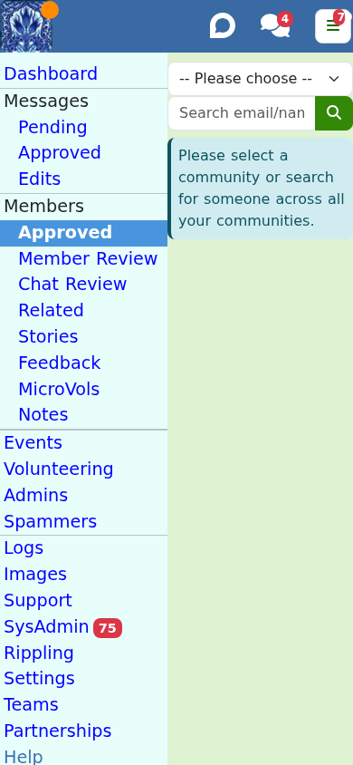

# Managing members

Most of moderation is about people, not posts. ModTools gives you tools to welcome, help,
review and, when you must, remove members.

## The members list

**Members > Approved** (`/members/approved`) lists a community's members.

From here you can:

- **Filter** by type (with notes, moderators, bouncing email, banned, mod-mails) and
  **search** by name, email or id.
- **Add** a member by email (this sends the standard welcome).
- **Ban** a member by id, with a reason.
- **Merge** two accounts that are the same person (irreversible; you choose which email
  survives).
- **Export** the members list.
- Change a member's **role** (Member, Moderator, Owner).

## "Email delayed" is not the same as "bouncing"

You may see a blue notice on a member saying **Email delayed since <date> - <provider> is
not currently accepting our mail**.

This is not a problem with that member's email address, and it is nothing they or you can
fix. It means the company that runs their email - Yahoo, Microsoft, whoever - has
temporarily stopped accepting mail from Freegle's sending servers. It affects everyone at
that provider at once, so if you see it on one member you will usually see it on many.

While that is going on we deliberately stop generating their emails rather than pile up
mail that cannot be delivered, and the notice tells you roughly how many we have held
back. When the provider starts accepting us again, they get a catch-up digest and a
summary of any unread chats. Stale post notifications are not resent, because by then the
item has usually gone.

So: nothing to do. Do not chase the member, and do not remove them.

Contrast this with the red **bouncing** notice, which really does mean their address is
rejecting mail - a closed account, a typo, a full mailbox - and where reactivating after
they have fixed it is the right move.

## Member review

**Members > Review** (`/members/review`) is a queue of members automatically flagged by
Freegle's unusual-behaviour checks, across all your communities. For each, you see notes,
spammer status, whether they are active in places far apart, whether they have changed
location repeatedly, bouncing-email status and ban history, plus a postcode tester.

Treat these as prompts to look, not verdicts. There is no rule against joining several
communities or posting enthusiastically. Ban only with clear evidence of harm, and prefer
leaving well-meaning members alone.

## Related members

**Members > Related** (`/members/related`) surfaces pairs of accounts that look like the
same person, or the same household. Each card says why the pair was picked up:

- both accounts were signed in from the same browser
- both gave the same mobile number in chat
- both gave the same street address in chat

The note names the accounts and says how many messages the details appeared in, and when, so
you can usually judge the pair without opening either chat.

Most pairs are innocent. People forget a password and register again, or a couple share a
phone. Nobody is blocked or flagged by appearing here. You can **ignore** the pair, or send
the member a friendly "let us know" email so **they** decide whether and how to merge their
own accounts. Merging helps, because replies sent to an account somebody has stopped using
are never read.

A shared postcode on its own is deliberately not enough to pair two accounts. A UK postcode
covers around fifteen homes, so it would pair neighbours.

## Spammers

**Spammers** (`/spammers`) is Freegle's shared spammer list. Everyone can search and view
confirmed spammers; with the Spam admin permission you also handle pending additions,
safelisting and removals. You can add a member to the list, safelist someone wrongly
flagged, or request a removal.

Reporting a genuine spammer helps every community, not just yours.

## Chat review

**Chats > Review** (`/chats/review`) shows member-to-member chat messages automatically
flagged for **worry words** (money, phone numbers, email addresses, bad language) or by a
community's "quicker chat review" setting. You can approve a message, or add a moderator
note that both people in the chat can see. "Delete All" clears the queue.

Some chats are held because a post has not yet rippled out to the member who replied.
Those release automatically; you do not need to do anything. See
[./rippling-out.md](./rippling-out.md).

(This is different from moderating the **ChitChat** discussion feed, which is done on the
main Freegle site by the ChitChat Moderation team, not in ModTools.)

## Notes about members

**Members > Notes** (`/members/notes`) is a feed of moderator notes. Flagged notes are
always visible; others are scoped to the selected community. You can add a note from many
places - a member row, the sender panel on a post, or the ban dialog, which records who
banned whom and why. Notes are how the team keeps a shared memory of a member.

## Messaging a member

- Use the **Mail** or **Leave** standard-message buttons on a member row.
- Or open **Chats** (`/chats`), which lists your conversations with members and with other
  moderators, with a chat pane and search.

## Banning and removing

On a member you can:

- **Remove** them from the community (they simply leave), or
- **Ban** them, which requires a reason and is confirmed with an extra step. A note is
  recorded automatically.

Removing or banning is a last resort. A friendly word usually solves the problem.

A ban stops someone posting on your community and replying to posts there. It does **not**
stop them writing to your volunteers, by email or with the Contact button on your community
page, and that is deliberate: it is how someone appeals a ban. Their message arrives in
their chat with your volunteers, which every moderator on the community can see.

The **spammer list** is the stronger measure. Someone on it is banned everywhere, and
nothing they send reaches us at all: their email is dropped, the volunteers address
included, and a message to volunteers from the site or app is never delivered. It does not
lock their account, so they can still sign in. Someone only *proposed* for the list, and
still waiting on a second moderator, can write to volunteers as normal, so they can put
their case before the decision is made.

Some members are on your list only because a post of theirs **rippled in**: rippling
joins the poster so the post can live on your community. That is not a relationship with
you, so such a member has no **Chat** button and no standard messages that only write to
them, and the removal standard message shows a plain confirmation instead of a compose
box. You can still remove or ban them, and it is logged as usual - quietly, since they
never joined you. If they later join, or move into your area, the membership becomes an
ordinary one. See [rippling out](rippling-out.md).

## Feedback and micro-volunteering

- **Members > Feedback** (`/members/feedback`) collects members' free-text feedback and
  happy/unhappy ratings, with charts, so you can see how the community feels.
- **Members > Micro-volunteering** (`/members/microvolunteering`) shows the members who
  help moderate through lightweight review tasks, with an accuracy score. These members
  are a real help; a thank-you goes a long way.

## Next steps

- The queues these members' posts flow through: [Moderating posts](moderating-posts.md).
- Community-level configuration: [Running your community](running-your-community.md).
