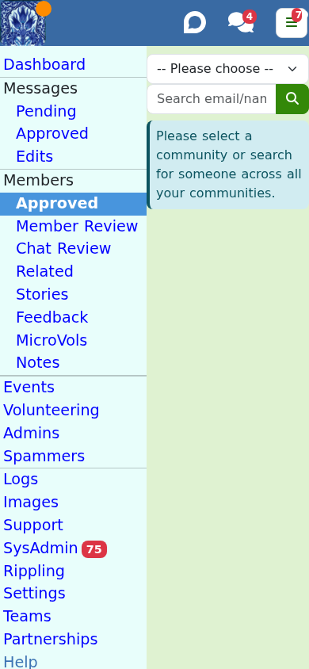

# Managing members

Most of moderation is about people, not posts. Moderators are national: there is no
community to belong to and nothing scoped to one. ModTools gives you tools to welcome,
help, review and, when you must, ban members.

## New members

**Members > Approved** (`/members/approved`) lists everyone who has signed up. Freegle
already ran its checks on each one when they joined. From here you can:

- **Filter** by type (with notes, moderators, bouncing email, banned, mod-mails) and
  **search** by name, email or id.
- **Add** a member by email (this sends the standard welcome).
- **Merge** two accounts that are the same person (irreversible; you choose which email
  survives).

## "Email delayed" is not the same as "bouncing"

You may see a blue notice on a member saying **Email delayed since <date> - <provider> is
not currently accepting our mail**.

This is not a problem with that member's email address, and it is nothing they or you can
fix. It means the company that runs their email - Yahoo, Microsoft, whoever - has
temporarily stopped accepting mail from Freegle's sending servers. It affects everyone at
that provider at once, so if you see it on one member you will usually see it on many.

While that is going on we deliberately stop generating their emails rather than pile up
mail that cannot be delivered, and the notice tells you roughly how many we have held
back. When the provider starts accepting us again, they get a catch-up digest and a
summary of any unread chats. Stale post notifications are not resent, because by then the
item has usually gone.

So: nothing to do. Do not chase the member, and do not remove them.

Contrast this with the red **bouncing** notice, which really does mean their address is
rejecting mail - a closed account, a typo, a full mailbox - and where reactivating after
they have fixed it is the right move.

## Flagged members

**Members > Review** (`/members/review`) lists members Freegle's unusual-behaviour checks
have already flagged. For each, you see notes, spammer status, whether they are active in
places far apart, whether they have changed location repeatedly, bouncing-email status and
ban history, plus a postcode tester.

Treat these as prompts to look, not verdicts. There is no rule against posting
enthusiastically. Ban only with clear evidence of harm, and prefer leaving well-meaning
members alone.

## Related members

**Members > Related** (`/members/related`) surfaces pairs of accounts that look like the
same person, or the same household. Each card says why the pair was picked up:

- both accounts were signed in from the same browser
- both gave the same mobile number in chat
- both gave the same street address in chat

The note names the accounts and says how many messages the details appeared in, and when, so
you can usually judge the pair without opening either chat.

If the two accounts have also replied to the same post, the note says so. That one is worth
a closer look. Someone with two accounts normally replies to different posts, so replying to
the same one means either they lost track of which account they were in, or they are putting
themselves forward twice for the same item.

Most pairs are innocent. People forget a password and register again, or a couple share a
phone. Nobody is blocked or flagged by appearing here. You can **ignore** the pair, or send
the member a friendly "let us know" email so **they** decide whether and how to merge their
own accounts. Merging helps, because replies sent to an account somebody has stopped using
are never read.

A shared postcode on its own is deliberately not enough to pair two accounts. A UK postcode
covers around fifteen homes, so it would pair neighbours.

## Spammers

**Spammers** (`/spammers`) is Freegle's shared spammer list. Everyone can search and view
confirmed spammers; with the Spam admin permission you also handle pending additions,
safelisting and removals. You can add a member to the list, safelist someone wrongly
flagged, or request a removal.

Reporting a genuine spammer helps everyone, not just the person who reported it.

## Notes about members

**Members > Notes** (`/members/notes`) is a feed of moderator notes. You can add a note
from many places - a member row, the sender panel on a post, or the ban dialog, which
records who banned whom and why. Notes are how the team keeps a shared memory of a member.

## Messaging a member

- Use the **Mail** or **Leave** standard-message buttons on a member row.
- Or open **Chats** (`/chats`), which lists your conversations with members and with other
  moderators, with a chat pane and search.

## Banning

Banning is a last resort. A friendly word usually solves the problem. When you must, ban a
member with a reason; the ban is confirmed with an extra step and a note is recorded
automatically.

A ban stops someone posting and replying to posts. It does **not** stop them writing to
the volunteer team, by email or with the Contact button, and that is deliberate: it is how
someone appeals a ban. Their message arrives under **Messages to Freegle**, which every
moderator can see. See [Moderating posts](moderating-posts.md).

The **spammer list** is the stronger measure. Someone on it is banned everywhere, and
nothing they send reaches us at all: their email is dropped, and a message to the
volunteer team from the site or app is never delivered. It does not lock their account, so
they can still sign in. Someone only *proposed* for the list, and still waiting on a second
moderator, can write to the volunteer team as normal, so they can put their case before the
decision is made.

## Partner platforms

Someone who posts through TrashNothing or LoveJunk arrives on Freegle as an ordinary
member and is moderated exactly the same way as anyone else. See
[TrashNothing](../developers/reference/trashnothing.md) for how the two platforms connect.

## Feedback and micro-volunteering

- **Members > Feedback** (`/members/feedback`) collects members' free-text feedback and
  happy/unhappy ratings, with charts, so you can see how members feel.
- **Members > Micro-volunteering** (`/members/microvolunteering`) shows the members who
  help moderate through lightweight review tasks, with an accuracy score. These members
  are a real help; a thank-you goes a long way.

## Next steps

- The posts these members send: [Moderating posts](moderating-posts.md).
- Other tools in ModTools: [README](README.md#other-modtools-pages).
