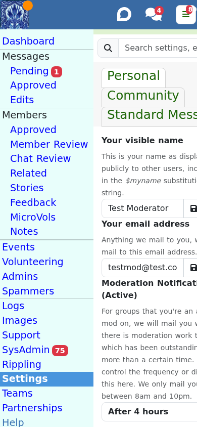

# Running your community

Beyond the daily queues, ModTools lets you configure how your community works and look
after its wider life: stories, events, broadcasts and more.

## Community settings

**Settings** (`/settings`) is where you configure a community (you need to be an Owner or
Moderator of it). It is a set of sections, each covering one topic:

- **Addresses** - the community's moderator email and short links.
- **Your settings** - your own active and notify preferences for this community.
- **How it looks** - appearance, logo and welcome.
- **Rules** - the local rules members see, and toggles for common cases (for example
  waste carriers, car boot sales, certain hazardous items).
- **Features for members** and **Features for moderators** - including "quicker chat
  review".
- **Micro-volunteering**, **Spam detection** and **Duplicate detection** tuning.
- **Mapping** - the community boundary, with a link to the map.
- **Social media** and **Status**.

Keep local rules short, apply them kindly, and do not try to enforce them on other
communities. A homepage with a logo, a tagline and a warm welcome message helps new
members settle in.

## Standard message sets

The **Standard Messages** tab under Settings is where you build the canned messages used
across the queues. A set of messages is a "config" that can be shared across several
communities and locked by whoever created it, and you can see who else is using a given
set.

Freegle provides plenty of starting-point messages for common situations, and a library
of whole-community **broadcast** templates (for example bank holidays, keeping it local,
no-shows, too many emails, safety, reselling). Adapt them to your own voice.

A message can mark part of its wording as something you must fill in each time, or as
something optional, using `<editthis>` and `<optional>` tags. See
[fill-in boxes and optional bits](moderating-posts.md#fill-in-boxes-and-optional-bits)
for what a moderator then sees when they send it.

**Export PDF** produces the whole set as one document: the general settings, the BCC
settings for each queue, and every standard message with its wording and what sending it
does. Useful for reviewing a set away from the screen, agreeing wording with your fellow
volunteers, or handing a community over. It works on locked sets too, since you can
already read and copy those.

## Stories and newsletters

- **Stories** (`/members/stories`) is a queue of member-submitted "why I freegle"
  stories. Review, edit lightly, and approve or decline them.
- **Newsletter** (`/members/newsletter`, needs the Newsletter permission) reviews stories
  destined for the newsletter specifically.

## Events and volunteering

- **Community events** (`/communityevents`) - review member-submitted local events, with
  Approve, Edit or Delete. Approved events appear to members and feed the weekly event
  roundup email.
- **Volunteering** (`/volunteering`) - the same review pattern for volunteering
  opportunities, including opportunities fed in from partners.

## Broadcasts to the whole community

**ADMINs** (`/admins`) sends a message to the whole community. You can create an
**Essential** message (which members cannot opt out of) or a **Newsletter** message
(which they can), optionally with a call-to-action button. Admins and Support can target a
single community or suggest copies to many communities that each community then edits and
approves. A community's own ADMIN goes to all its members; a copy of a suggested ADMIN only goes to
members active in the last six months, to keep a burst of mail across every community from drawing spam
reports. Use these sparingly and keep them warm.

While Freegle is in a [lockdown](../ops/runbooks/lockdown.md), creating, editing or deleting
an ADMIN is refused for moderators; Support and Admin are exempt.

When Support or Admin suggests an ADMIN to every community, they can add **Guidance for
local moderators (NOT sent to members)** on the Create tab. It is a separate box from the
message body. Each community's copy shows that guidance in a highlighted box above the
message, telling you how you might adapt the ADMIN for your community. It is only advice for
you: it is never part of the email, and editing or approving your copy does not send it.

The Create tab and each pending copy also have an optional **Send after** date and time. An
approved ADMIN is held until then. Leave it empty to send as soon as it is approved. The email's
subject line starts "ADMIN:" for an Essential message and "NEWSLETTER:" for a Newsletter one, and
a prefix typed into the subject is not doubled.

The message body is **plain text**, and it is required. HTML typed into it is refused, though
placeholders in angle brackets such as `<your names here>` are fine. If you know
[MJML](https://mjml.io), you can also tick the box to add a **designed version**. Paste only the
`<mj-section>` elements from inside `<mj-body>`. Freegle adds its own header, footer and
unsubscribe links. Members whose email shows formatted mail get the designed version and
everyone else gets the plain text, so both must say the same. Before it is sent, scripts, forms,
embedded frames, event handlers and links that are not http, https, mailto or tel are removed.
A designed version has no separate big button: put any buttons in the MJML.

A pending ADMIN can be switched between Essential and Newsletter before it is approved, with the
same toggle as the Create tab.

On a pending ADMIN with a designed version, the two versions are shown as tabs, *Plain text version*
and *Designed (MJML) version*, with a reminder that every member gets one of them, so any change
must be made in both. Saving a change to only one of them asks you to confirm. The MJML tab says how
to change the wording without touching the tags, and links to the
[MJML live editor](https://mjml.io/try-it-live) for checking how it looks. A text-only pending ADMIN
can have a designed version added with a tick box.

Creating an ADMIN (*Save to Pending ADMINs*) sends nothing: it goes to the Pending tab.
**Before a pending ADMIN with a designed version can be approved, you must send a test of it.**
Text-only ADMINs need no test. Give one email address (it starts as your own) and press
*Send one test to this address only*. That sends one email, to that
address only, built exactly as a member of that community would get it, with "TEST:" in front of
the subject. *Approve and send to all members* stays unavailable until the test is sent, and any
change after the test needs a new test. The exception is a copy of a suggested ADMIN that nobody
has changed, which can be approved without a test.

## Logs and maps

- **Logs** (`/logs`) is a searchable audit trail of moderation, tabbed by Messages and
  Members and filterable by community and free text. It is where you check "who did what".
- **Map** (`/map`) shows a community's boundary and overlaps, all your communities
  together, or "caretaker" communities that currently have no active moderators.

## Rippling explorer

**Rippling** (`/rippling`) is an interactive map and analytics tool showing how posts
ripple between neighbouring communities. It needs a moment to warm up its backing spatial
service. It is useful for understanding why a post turned up where it did.

## Specialist tools (permission-gated)

- **Gift Aid** (`/giftaid`, Gift Aid permission) - search Gift Aid declarations and their
  linked donations.
- **Freegle Helper / Clearances** (`/helper-escalated` and the helper flow, Clearance
  permission) - the queue for the AI concierge that manages replies to bulk clearance
  offers, plus a read-only explainer of how it works.

## Support and sysadmin tools (Support and Admin only)

These pages are only available to volunteers with the Support or Admin system role:

- **Sysadmin** (`/sysadmin`) - housekeeping, cron jobs, outgoing and incoming email,
  scrolling and click-through analytics, and rippling analytics.
- **Support** (`/support`) - look up a user, community or message, the AI Support Helper
  (work in progress), and spam keyword configuration.
- **Images** (`/images`) - review and regenerate AI-generated item images that volunteers
  have flagged.

## Partner platforms: TrashNothing and LoveJunk

Freegle works with two partner platforms, and their users turn up in your community. The
one thing to remember is simple: **treat these members exactly like any other** - approve,
chat and moderate them as normal.

- **TrashNothing** is another app people can use to read and reply to Freegle posts. Someone
  who joined through TrashNothing appears as an ordinary member and posts and replies just
  like anyone else. A few of their settings (some email and notification preferences) are
  managed by TrashNothing rather than Freegle, so those options may be hidden on their
  member panel.
- **LoveJunk** is a reuse marketplace that Freegle shares OFFERs with, to help more items
  get taken. By default your community's OFFERs are also shown on LoveJunk, and LoveJunk
  users can reply through the normal chat. Those members show a "LoveJunk user" note on
  their panel, and their chat messages are kept in step between the two sites.

Whether your community shares posts with TrashNothing and LoveJunk is a community setting.
There is technical detail for the curious in [../developers/reference/trashnothing.md](../developers/reference/trashnothing.md).

## Next steps

- Back to the daily work: [Moderating posts](moderating-posts.md) and
  [Managing members](managing-members.md).
- New to ModTools? Start with [Getting started](getting-started.md).
