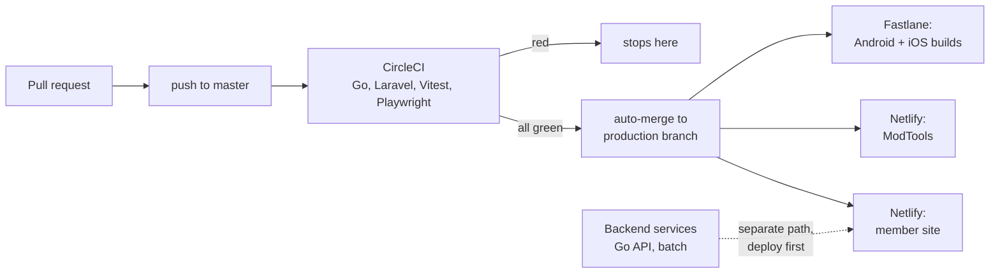

# Deployment and CI

This describes how code reaches production. The CI reference is
[./reference/circleci.md](./reference/circleci.md).

## The web pipeline




1. **Push to `master`.** CircleCI runs the full test suite (Go, PHPUnit, Laravel, Vitest,
   Playwright) via a shared reusable orb. New raw SQL is kept out at authoring time by the
   `.claude/check-raw-sql.sh` hook rather than by a CI gate - the ORM migration inventory
   ratchet that used to run here was retired once the Go migration reached zero raw sites.
2. **On green, `master` auto-merges to `production`.** This is automatic only when all
   tests pass.
3. **`production` deploys the frontends.** Two Netlify sites build from the same
   `production` branch with different build commands:
   - the **member site** (ilovefreegle.org) with `npm run build`, and
   - **ModTools** (modtools.org) with `cd modtools && npm run build`.
4. **Backend services** (the Go and PHP APIs and the Laravel batch app) deploy through
   their own path, separate from the Netlify frontend flow.

### Backend first

When a change spans both, deploy the **backend before** the frontend that depends on it,
so the frontend never calls an endpoint that is not there yet. This ordering rule is in
[../developers/reference/coding-standards.md](../developers/reference/coding-standards.md).

## The mobile app pipeline

Android (and iOS) builds run from the `production` branch. The Android flow builds the app
and uploads it to Google Play's internal track via Fastlane, with a weekly manual
promotion from internal to beta to production. Detail is in
[./reference/circleci.md](./reference/circleci.md) and [../developers/reference/mobile-app.md](../developers/reference/mobile-app.md).

## CI runner

CircleCI runs through a shared reusable **orb** (`freegle/tests`). Every branch runs the
full suite: the orb used to skip suites a change could not affect, but path-based skipping
was removed because a partial upload made Coveralls report a false large decrease against
master. An optional **self-hosted runner** speeds up builds, with automatic fallback to
cloud runners if it is unavailable.

Operational notes worth knowing:

- Docker build caching is controlled by a CI environment variable; bumping version
  suffixes in the orb invalidates the cache.
- When you change tests, **publish the orb** so CI picks the change up. Editing the
  orb source in this repo changes nothing on its own: CircleCI resolves the orb from
  the registry, and the pin in `continue-config.yml` is what decides which published
  version runs. An unpublished orb change is inert, not broken.
- **Do not write the next version number into a commit message before publishing it.**
  Versions are immutable and first-come, so a branch can take the number another
  branch was about to use, and the second change then goes out under no version at
  all. Publish, confirm with `circleci orb info freegle/tests`, then bump the pin.
- A pin published from a branch carries that branch's orb changes. Master must not
  adopt it until the branch merges, or master's jobs run steps for code it does not
  have.
- SSH debugging of CI machines is available to the team, gated by their CircleCI
  credentials. The mechanics are internal and not reproduced here.

### When Coveralls goes red

Coveralls reports a percentage delta, never which statements moved, so a small decrease on
a commit that changes none of that language is not self-explaining. The Go suite in
particular is not reproducible run to run: it shares `iznik_go_test` with the Laravel suite
running at the same time, so load-dependent error and timeout branches are covered on one
run and not the next. One statement is roughly 0.004% of the Go total, which is enough to
turn the delta gate red on its own.

**The profile is already kept, and diffing it is the whole answer.** Every
`build-and-test` stores `~/artifacts/go/coverage.out` — per-block statement counts, which
is exactly what a build-to-build diff needs. Fetch it from two builds and compare, rather
than reasoning about what a percentage might mean:

```
curl -sS "https://circleci.com/api/v2/project/gh/Freegle/Iznik/<job>/artifacts"   # find the url
```

Both the job API and the artifact download work without a CircleCI token.

That diff has already paid for itself. Builds 32736 and 32751 differed by exactly one
block — `recommendations/stats.go`'s `sortDaily` swap. Nothing tested `sortDaily`
directly; it was reached only through a DB-backed test whose rows carry no `ORDER BY`, so
the swap ran only when MySQL happened to return the days out of order, which under CI's
concurrent load varied build to build. One statement is 0.004–0.005% of this suite, which
is the whole of a typical red. It now has its own unit tests.

The Go coverage run is also serialised (`-p 1`, in
`status-nuxt/server/api/tests/go.post.ts`): the suite's ~10 packages otherwise hit the
single `iznik_go_test` database concurrently, on a runner already running iznik-batch,
Playwright and Vitest alongside them. It costs no wall clock — Go finishes well inside a
step whose critical path is Playwright — but be clear about what it did not do: the first
build carrying it still went red at -0.005%, so serialising did not make the number
reproducible on its own.

The same delta gate can go red on the other suites for the same reason. The cheapest check
is whether the failing suite's language appears in the diff at all: a Go-only commit that
turns `Coveralls - vitest` red has not changed any JavaScript, so the number moved without
the code moving.

## Rollback

Because `production` is a branch that deploys on update, and Netlify keeps previous
deploys, a bad frontend deploy can be rolled back by reverting on `production` or
redeploying a previous build. Backend rollback follows the backend deploy path. Keep the
backend-first ordering in mind when rolling back a paired change (roll the frontend back
first).
