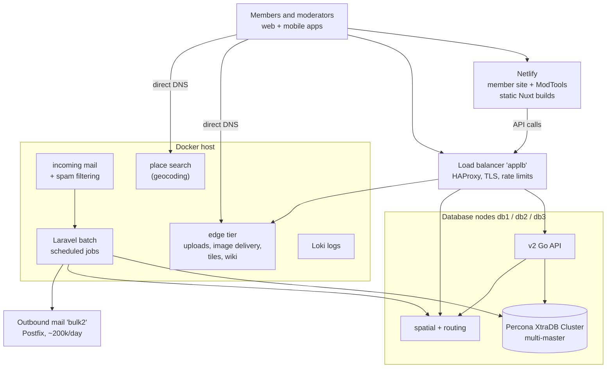

# Production topology

This page describes the **live production deployment** at the machine level: what the
individual machines are, what roles they have, and what routes where. It follows the
[rule for this section](README.md): **no IP addresses, credentials or other
confidential detail** - those live in the ops team's internal notes. Machine names
below are role labels, not connection instructions.

## The machines

Netlify serves the two websites. The load balancer fronts anything interactive. The Docker
host serves the content hostnames directly and does all the background work.

| Machine | Role |
|---------|------|
| **Load balancer** ("applb") | HAProxy. TLS termination and the public front door for everything that is not served by Netlify or directly by the Docker host. Chooses backends per hostname/path (table below), terminates the old-domain redirects, and applies per-user API rate limits. |
| **Database nodes** ("db1", "db2", "db3") | A **Percona XtraDB Cluster** - all three are equal masters; there is no primary/replica. Each node **also** runs, natively under monit: the **v2 Go API**, the **spatial (KNN)** server and the **routing** server. |
| **Docker host** ("docker", the FreegleDocker host) | One machine running the production Docker Compose stack (profiles `backend,production,mail,edge`): the **batch** scheduler (Laravel jobs), **incoming mail** processing, **Loki** log aggregation, Redis, MJML email rendering, the embedding sidecar (semantic search), the AI support helper, the status monitor, and the **spatial** service that answers place search for `geocode.ilovefreegle.org` - plus the user-facing **edge tier** (below). Natively under monit: a host nginx. |
| **Outbound mail** ("bulk2") | Postfix relay that sends the bulk mail (digests, notifications) - of the order of 200k messages/day. |
| **app1** (being retired) | The old frontend server. Carries **no live HTTP traffic**; it remains only as a warm backup backend behind the load balancer until decommissioned. |
| **Netlify** (SaaS) | Builds and hosts the two static Nuxt frontends (member site and ModTools) from the `production` branch - see [Deployment and CI](deployment-and-ci.md). |

Other external services: **Sentry** (error tracking), **Discourse** (volunteer forum,
externally hosted), Google Workspace (staff `@ilovefreegle.org` mail). Image originals
live on a cloud **NFS share** mounted by the Docker host (and app1 as backup).

## The edge tier

The "edge" tier is the set of user-facing services that historically ran on separate
frontend machines and have been **consolidated onto the Docker host** as Compose
services under the `edge` profile (scale-in-place rather than separate machines):

- **front nginx** - single front door for the edge vhosts.
- **image delivery** - a weserv-based resizing/caching proxy.
- **uploads** - tusd, storing onto the NFS share.
- **map tiles** - an OSM tile server (PostGIS + renderd) with its own replication.
- **wiki** - MediaWiki with its own MySQL.

There is **no separate edge machine**: `edge` names the Compose profile/role, not a
host. Place search for `geocode.ilovefreegle.org` is served from the same machine by the
spatial container, behind the same host nginx.

## What routes where

| Public name | Path |
|-------------|------|
| `www.ilovefreegle.org` | Netlify (member site). |
| `modtools.org` | Load balancer → Netlify static build; `/api/ai-support` → AI support helper (Docker host); API calls → v2 API. |
| `api.ilovefreegle.org` | Load balancer → **v2 Go API on the database nodes**. One node is the active backend; the others are backups. |
| Shortlinks (`freegle.in`, `freegle.it`, `frgl.it`) | Load balancer → v2 API. |
| `uploads.ilovefreegle.org` | Load balancer → tusd on the Docker host (app1 backup). |
| `delivery.ilovefreegle.org` | Load balancer → image delivery cache on the Docker host (app1 backup). |
| `images.ilovefreegle.org`, `users.ilovefreegle.org` (web) | Load balancer → edge front nginx on the Docker host (legacy image URLs resolve via the v2 API; `users` 302s to the member site). |
| `spatial.ilovefreegle.org` | Load balancer → routing server on the database nodes (one active, one backup). |
| `tiles.ilovefreegle.org` | **Direct DNS to the Docker host** → host nginx → tile server container. |
| `geocode.ilovefreegle.org` | **Direct DNS to the Docker host** → host nginx (response cache, rate limits) → the spatial service's place search. |
| `wiki.ilovefreegle.org` | Direct DNS to the Docker host → MediaWiki containers. |
| Old domains (`freegle.org.uk`, `lovefreegle.org`, …) | 302 redirects issued at the load balancer. |
| `…@users.ilovefreegle.org` (reply mail, MX) | Docker host → Postfix container → spam filtering → batch API. See [Domains, services and runbooks](domains-services-and-runbooks.md#mail-and-spam-filtering). |

So the load balancer fronts anything interactive; the Docker host serves the
"content" hostnames directly; Netlify serves the static apps.

## Databases and APIs together

The database nodes double as API servers deliberately: each API instance reads
locally-ish but **all writes funnel to a single nominated node**, and reads go to
another, an app-level convention that avoids Galera write conflicts - see
[Database read/write split](reference/database-read-write-split.md). The load
balancer keeps one node active per backend so failover is a backend switch, not a
DNS change.

The spatial and routing services run in **two places**: natively on the database
nodes (serving the web path via the API and the public spatial hostname), and as
containers on the Docker host (serving the batch/digest path). A deploy must cover
both - see [Deployment and CI](deployment-and-ci.md).

## Failure behaviour worth knowing

- The member site, ModTools, the API and the database **stay up if the Docker host is
  down**. What stops: batch jobs (digests, scheduled mail, rippling), incoming reply
  mail (senders queue and retry), tiles/geocode/wiki, and uploads/image delivery
  unless the load balancer fails them back to app1.
- The spatial/routing services rebuild large in-memory country graphs on start, so a
  restart takes minutes, not seconds - plan restarts accordingly (see
  [Domains, services and runbooks](domains-services-and-runbooks.md#spatial-and-routing-services)).
- On the Docker host, the Compose stack is started at boot by a systemd unit and the
  native services are supervised by monit; host-specific reboot checklists are kept
  in the ops team's internal runbooks.
