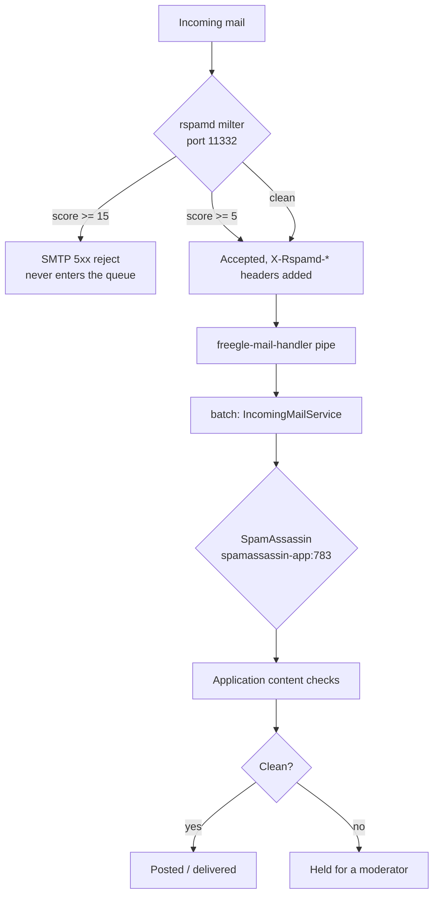

# Spam and abuse

Freegle is an open platform that lets strangers post text and photos and then message each
other. That makes it a target. Defence is layered: mail-layer filtering, application-layer
content checks, and human moderators. This page covers the first two and says where the
third is documented.

## The layers, in order



Posts and chat messages created **through the website or app** skip the mail layer
entirely and enter at the application content checks.

## Mail layer: rspamd

Rspamd runs as a **Postfix milter on port 11332**. Every incoming SMTP connection is
scored.

- **Score >= 15**: rejected with an SMTP 5xx before the message enters the Postfix queue.
  Rejecting at SMTP time is deliberate - the sending server is told, so a legitimate
  sender caught by mistake gets a bounce rather than silence.
- **Score >= 5**: accepted, with `X-Rspamd-*` headers added for later stages to use.
- **`milter_default_action = accept`**: if rspamd is unreachable, Postfix accepts mail
  normally and the SpamAssassin stage still runs. The filter failing does not stop the
  mail.

**Tuning.** Review the score distribution in the rspamd web UI History tab and adjust
`conf/rspamd/local.d/actions.conf`. Start conservative (`reject=15`) and lower gradually.
The web UI is password-protected; set the password as an encrypted hash with
`rspamadm pw --encrypt`, and keep it in the ops password vault, never in the repository.

**Where milter-modified mail actually goes.** Mail to `groups.ilovefreegle.org`,
`users.ilovefreegle.org` and similar is routed by `transport_maps` to the
`freegle-mail-handler` pipe, which POSTs the now-decorated message to the batch
processor's `/api/mail/incoming` endpoint. It does **not** go to mailpit. To check
headers and scores, look at the batch logs or the rspamd History tab.

## Mail layer: SpamAssassin, in parallel

Rspamd and SpamAssassin both see every non-rejected incoming message, but they run **in
parallel at different layers**, not one inside the other:

1. Postfix's milter calls **rspamd only**. Hard rejects happen here, at SMTP time.
2. Surviving messages reach the batch processor, where `IncomingMailService::checkForSpam()`
   calls **SpamAssassin only**, speaking `SPAMC/1.2` to `spamassassin-app:783`. Chat
   message paths call it too, via `getSpamAssassinScore()`.

**The rspamd `spamassassin` plugin is not used and must not be configured.** It loads
SpamAssassin `.cf` rule files; it does not talk to a remote `spamd` daemon, which is what
we have. That is why there is no `local.d/spamassassin.conf`.

There is also a dormant outgoing-mail equivalent, `RspamdService::checkAll()`, which would
consult both filters in parallel and attach both header sets. It is currently inert
(`SPAM_CHECK_ENABLED=false`).

## Application layer: content checks

Everything that reaches the platform - by mail, website or app - passes through
`ContentCheckService`. Its job is not to decide "spam or not" but to decide **whether a
human should look before this goes live**. The relevant entry points are
`checkMessage()` for posts and `checkChatMessage()` for chat.

A third, `checkGroupOwnRules()`, runs as a post ripples into another community. The post
was already weighed against the rules of the community it was posted on, Freegle-wide
keywords included, and a moderator there may have approved it knowing that. So only the
receiving community's **own** keywords and worry words are asked. A match makes that
community's copy Pending with the reasons recorded in
`messages_groups.contentcheck_reasons`, and auto-approve leaves such a copy for a human
rather than releasing it when the veto window runs out.

The checks never approve a copy a moderator has held, or one marked
`messages_groups.needs_moderator` because a moderator sent the post back to pending. They
record what they found and leave the decision to that community's moderators.

Reference data lives in its own tables, each with a moderator-facing editor in ModTools:

| Table | What it holds |
|---|---|
| `concern_keywords` | Phrases that flag or block a post or chat message, Freegle-wide (`scope = global`) or for one community. `category = allowed` rows are the whitelist: phrases such as place and shop names that must never feed a match |
| `worrywords` | Words that signal a safeguarding or welfare concern rather than spam - these route to people, not to a bin |
| `spam_users` | Known bad accounts, shared across communities |
| `spam_countries` | Country-level signals |
| `spam_whitelist_ips`, `spam_whitelist_links`, `spam_whitelist_subjects` | Explicit exemptions, because a blunt keyword list catches real posts |

The whitelists exist because the keyword lists over-match. A migration that moved
keywords without carrying the whitelist branch across once turned thirteen legitimate
place and shop names into flag words. If you change how keyword matching works, check
the whitelist path is still honoured.

Matching is deliberately fuzzy (inflections, Damerau-Levenshtein distance) because
spammers misspell on purpose. That also means it produces false positives, which is why
the outcome for a **flag** keyword is "hold for a moderator", not "delete".

### Flag and block keywords

A concern keyword's `action` decides what a match does. The two are not degrees of
the same thing; they are different decisions.

- **flag** holds the content for a human. A post stays Pending; a chat message from a
  Moderated member goes to Chat Review. Before the scan, `allowed` phrases are removed
  from the text, and a match can be waived when the embedding sidecar judges the
  context innocent ("glue gun" against a weapons keyword). Both exist to spare
  ordinary words in ordinary posts.
- **block** is absolute. The keyword is matched against the text as written: allowed
  phrases are not removed first (the whitelist holds everyday words such as "shop",
  and stripping one out of the middle of "ilovefreegle.shop" would leave the keyword
  nothing to match), the innocent-context waiver is not consulted, and a block match
  is reported ahead of any flag match. A post that matches goes to the Spam
  collection. A chat message that matches is dropped: `reviewrequired = 0,
  reviewrejected = 1`, the row a moderator's Reject writes, with the reason kept. It
  is never delivered, never emailed, never pushed, and never enters Chat Review; a
  wave of scam mail must not land thousands of items on the volunteers. This applies
  to Moderated and Fully-moderated senders alike (Unmoderated senders skip content
  checks). `ChatProcessService` logs one line per drop and counts them in the run
  summary.

Literal keywords match whole words, case-insensitively, with Unicode-aware boundaries.

### Text is folded before matching

Scam mail dodges keyword filters by spelling the same letters differently. Both the
text and every literal or fuzzy keyword go through `KeywordTextNormalizer` first, so a
plain ASCII keyword matches every spelling and the keyword list does not have to
enumerate them:

1. **NFKC** folds mathematical alphabets (bold, italic, script, fraktur, double-struck,
   sans, monospace), fullwidth forms, circled letters, superscripts and ligatures to
   plain letters.
2. **Invisible characters** (zero-width space, joiner and non-joiner, word joiner, byte
   order mark, soft hyphen, invisible separator, bidi overrides) and **combining marks**
   are removed. In ordinary chat these occur only inside emoji sequences and phone
   signatures, and removing them there changes nothing.
3. **Dot look-alikes** become `.`: ideographic full stop, middle dots, bullets, `[.]`,
   `(.)` and "dot" spelled out between letters, so `ilovefreegle[.]shop` and
   `ilovefreegle dot shop` are the domain.
4. **Look-alike letters** from Cyrillic, Greek and the small-capital blocks fold to
   ASCII (`іlоvеfrееglе`, `ɪʟᴏᴠᴇꜰʀᴇᴇɢʟᴇ`).
5. Lower-case.

A block keyword whose letters-and-digits skeleton is at least
`ContentCheckService::SKELETON_MIN_LENGTH` (10) characters - a domain, a phrase - also
gets a second pass that accepts its letters in order with up to three other characters
between each pair, and nothing alphanumeric stuck to either end, so
`i l o v e f r e e g l e . s h o p` and `i-l-o-v-e-f-r-e-e-g-l-e[.]s-h-o-p` still match
while `shopping` and `ilovefreegleshopper` do not. Short keywords and flag keywords never
get that pass. The pass is deliberately blind to spacing, so a block domain made of
ordinary words also matches those words written in a row: `ilovefreegle.shop` drops
"I love Freegle. Shop local". Choose block domains with that in mind, or use a flag
keyword, which holds for review instead. Regex keywords are used as written, against
the folded text.

### Backfill when a block keyword is created

A block keyword is usually added in response to a wave that has already landed, so
creating a Freegle-wide one through the Go API (`config.CreateConcernKeyword`) queues a
`concern_keyword_backfill` background task, and `queue:background-tasks` applies the
keyword to the last 24 hours of chat messages and posts. Chat messages that were
delivered and match are rejected as above. Posts that match are removed the way a
moderator's Spam action removes them (`messages_spamham` row, `messages_groups.deleted
= 1`, `messages.deleted` once no live copy remains, `freebie_alerts_remove` queued). A
post here means a `messages` row with a live copy on a community; a mail that never
became one - a member's "Reporting member" mail quoting the scam, an emailed chat reply -
has no `messages_groups` row and is left alone. Every write is a single-row statement
with a short pause after it, and a re-run over the same window changes nothing.

The same pass is available by hand:

```
php artisan content:reject-blocked-keyword --since="2026-09-20 00:00:00" --keyword=3830 --dry-run
```

`--since` widens the window (default 24 hours), `--keyword` (id or text, repeatable)
restricts it to particular keywords, `--limit` caps matches, and `--dry-run` reports
counts per keyword and sample ids without changing anything. Matching goes through
`ContentCheckService::checkBlockKeywords()`, the same test the processor applies.

## Chat spam and cleanup

- **`ChatSpamService`** - `autoMarkSpam()` flags chat spam automatically;
  `warnInnocentUsers()` emails members who were messaged by an account later found to be
  a spammer. That second half matters: the damage from chat spam is done at the moment it
  is read, so telling the recipient is part of the fix.
- **`SpamCleanupService`** - once an account is confirmed as a spammer, removes the trail:
  memberships, messages, chat messages, newsfeed items, notifications and sessions. Every
  method supports `--dry-run`; use it first.

## Human moderation

Volunteer moderators are the last and most important layer, and for many categories the
only one that can work - "duplicate", "out of area" and "posted too soon" all need context
no filter has. What they see and do is documented for them in
[../../moderators/moderating-posts.md](../../moderators/moderating-posts.md) and
[../../moderators/managing-members.md](../../moderators/managing-members.md).

## Why there is no AI moderator

This was measured rather than assumed. `llm-modbot/` holds a fine-tuning experiment on
production moderation data, and the result was negative for the thing that matters:

- **Approve/reject decisions**: 63.5% accuracy fine-tuned against 63.0% for the base
  model. No meaningful improvement. A small model cannot learn these calls from message
  text alone, because the common rejection reasons depend on facts outside the text.
- **Subject-line correction**: exact match went from 3% to 17%. A real improvement, still
  far from usable.

See [`llm-modbot/RESULTS.md`](../../../llm-modbot/RESULTS.md) before proposing this again.
The useful reading is that AI helps with formatting and spelling, and does not help with
judgement.

## Operational notes

- Spam filtering is not the same problem as **deliverability**. If members are not
  receiving Freegle's mail, that is the outbound relay and provider reputation - see
  [`ops/hosts/SERVICES.md`](../../../ops/hosts/SERVICES.md), not this page.
- Mobile network address ranges are refreshed by a scheduled command
  (`Spam/RefreshMobileCidrsCommand`) so that mobile users are not penalised for shared
  addresses.
- Changing a threshold is cheap; changing what happens at a threshold is not. Prefer
  moving a score boundary over adding a new rule.
