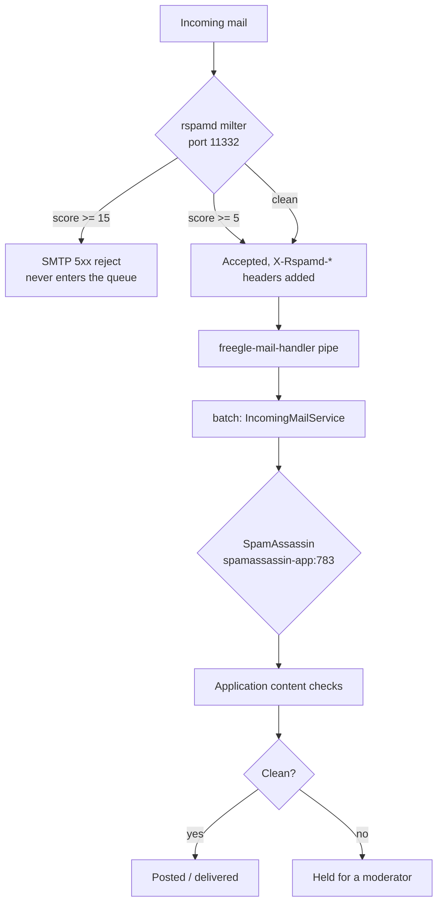

# Spam and abuse

Freegle is an open platform that lets strangers post text and photos and then message each
other. That makes it a target. Defence is layered: mail-layer filtering, application-layer
content checks, and human moderators. This page covers the first two and says where the
third is documented.

## The layers, in order

Posts and chat messages created **through the website or app** skip the mail layer
entirely and enter at the application content checks.

## Mail layer: rspamd

Rspamd runs as a **Postfix milter on port 11332**. Every incoming SMTP connection is
scored.

- **Score >= 15**: rejected with an SMTP 5xx before the message enters the Postfix queue.
  Rejecting at SMTP time is deliberate - the sending server is told, so a legitimate
  sender caught by mistake gets a bounce rather than silence.
- **Score >= 5**: accepted, with `X-Rspamd-*` headers added for later stages to use.
- **`milter_default_action = accept`**: if rspamd is unreachable, Postfix accepts mail
  normally and the SpamAssassin stage still runs. The filter failing does not stop the
  mail.

**Tuning.** Review the score distribution in the rspamd web UI History tab and adjust
`conf/rspamd/local.d/actions.conf`. Start conservative (`reject=15`) and lower gradually.
The web UI is password-protected; set the password as an encrypted hash with
`rspamadm pw --encrypt`, and keep it in the ops password vault, never in the repository.

**Where milter-modified mail actually goes.** Mail to `groups.ilovefreegle.org`,
`users.ilovefreegle.org` and similar is routed by `transport_maps` to the
`freegle-mail-handler` pipe, which POSTs the now-decorated message to the batch
processor's `/api/mail/incoming` endpoint. It does **not** go to mailpit. To check
headers and scores, look at the batch logs or the rspamd History tab.

## Mail layer: SpamAssassin, in parallel

Rspamd and SpamAssassin both see every non-rejected incoming message, but they run **in
parallel at different layers**, not one inside the other:

1. Postfix's milter calls **rspamd only**. Hard rejects happen here, at SMTP time.
2. Surviving messages reach the batch processor, where `IncomingMailService::checkForSpam()`
   calls **SpamAssassin only**, speaking `SPAMC/1.2` to `spamassassin-app:783`. Chat
   message paths call it too, via `getSpamAssassinScore()`.

**The rspamd `spamassassin` plugin is not used and must not be configured.** It loads
SpamAssassin `.cf` rule files; it does not talk to a remote `spamd` daemon, which is what
we have. That is why there is no `local.d/spamassassin.conf`.

There is also a dormant outgoing-mail equivalent, `RspamdService::checkAll()`, which would
consult both filters in parallel and attach both header sets. It is currently inert
(`SPAM_CHECK_ENABLED=false`).

## Application layer: content checks

Everything that reaches the platform - by mail, website or app - passes through
`ContentCheckService`. Its job is not to decide "spam or not" but to decide **whether a
human should look before this goes live**. The relevant entry points are
`checkMessage()` for posts and `checkChatMessage()` for chat.

A third, `checkGroupOwnRules()`, runs as a post ripples into another community. The post
was already weighed against the rules of the community it was posted on, Freegle-wide
keywords included, and a moderator there may have approved it knowing that. So only the
receiving community's **own** keywords and worry words are asked. A match makes that
community's copy Pending with the reasons recorded in
`messages_groups.contentcheck_reasons`, and auto-approve leaves such a copy for a human
rather than releasing it when the veto window runs out.

`contentcheck_reasons` carries two different things, and a reader must say which it
means. Findings (`Money`, `ConcernKeyword`, `PerGroupWorryWord`, ...) are what the checks
caught. Explanations (`MemberModerated`, `GroupModerated`, `NoLocation`) are written by
`holdReasons()` to say why a clean post is waiting, and every post from a member no
moderator has given a posting status carries `MemberModerated`. So nothing decides on the
column being NULL: `reasonsHoldByGroupOwnRules()` picks out the receiving community's own
findings for a rippled-in copy, and `reasonsAreContentClean()` / `contentCleanSql()` treat
a post carrying only explanations as clean for the post-moderation clean path
(`NoLocation` excepted - a post nobody can place is not publishable).

Reference data lives in its own tables, each with a moderator-facing editor in ModTools:

| Table | What it holds |
|---|---|
| `spam_keywords` | Phrases that flag or block a post |
| `worrywords` | Words that signal a safeguarding or welfare concern rather than spam - these route to people, not to a bin |
| `spam_users` | Known bad accounts, shared across communities |
| `spam_countries` | Country-level signals |
| `spam_whitelist_ips`, `spam_whitelist_links`, `spam_whitelist_subjects` | Explicit exemptions, because a blunt keyword list catches real posts |

The whitelists exist because the keyword lists over-match. A migration that moved
keywords without carrying the whitelist branch across once turned thirteen legitimate
place and shop names into flag words. If you change how keyword matching works, check
the whitelist path is still honoured.

Matching is deliberately fuzzy (inflections, Damerau-Levenshtein distance) because
spammers misspell on purpose. That also means it produces false positives, which is why
the outcome is "hold for a moderator", not "delete".

## Chat spam and cleanup

- **`ChatSpamService`** - `autoMarkSpam()` flags chat spam automatically;
  `warnInnocentUsers()` emails members who were messaged by an account later found to be
  a spammer. That second half matters: the damage from chat spam is done at the moment it
  is read, so telling the recipient is part of the fix.
- **`SpamCleanupService`** - once an account is confirmed as a spammer, removes the trail:
  memberships, messages, chat messages, newsfeed items, notifications and sessions. Every
  method supports `--dry-run`; use it first.

## Human moderation

Volunteer moderators are the last and most important layer, and for many categories the
only one that can work - "duplicate", "out of area" and "posted too soon" all need context
no filter has. What they see and do is documented for them in
[../../moderators/moderating-posts.md](../../moderators/moderating-posts.md) and
[../../moderators/managing-members.md](../../moderators/managing-members.md).

## Why there is no AI moderator

This was measured rather than assumed. `llm-modbot/` holds a fine-tuning experiment on
production moderation data, and the result was negative for the thing that matters:

- **Approve/reject decisions**: 63.5% accuracy fine-tuned against 63.0% for the base
  model. No meaningful improvement. A small model cannot learn these calls from message
  text alone, because the common rejection reasons depend on facts outside the text.
- **Subject-line correction**: exact match went from 3% to 17%. A real improvement, still
  far from usable.

See [`llm-modbot/RESULTS.md`](../../../llm-modbot/RESULTS.md) before proposing this again.
The useful reading is that AI helps with formatting and spelling, and does not help with
judgement.

## Operational notes

- Spam filtering is not the same problem as **deliverability**. If members are not
  receiving Freegle's mail, that is the outbound relay and provider reputation - see
  [`ops/hosts/SERVICES.md`](../../../ops/hosts/SERVICES.md), not this page.
- Mobile network address ranges are refreshed by a scheduled command
  (`Spam/RefreshMobileCidrsCommand`) so that mobile users are not penalised for shared
  addresses.
- Changing a threshold is cheap; changing what happens at a threshold is not. Prefer
  moving a score boundary over adding a new rule.
