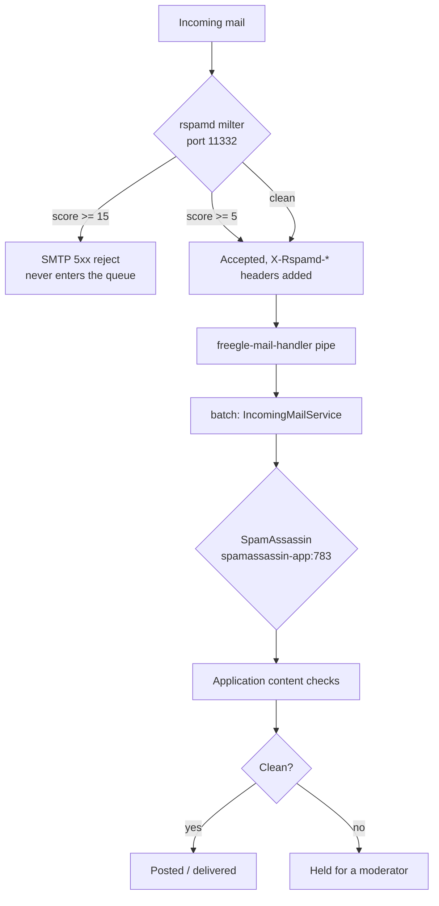

# Spam and abuse

Freegle is an open platform that lets strangers post text and photos and then message each
other. That makes it a target. Defence is layered: mail-layer filtering, application-layer
content checks, and human moderators. This page covers the first two and says where the
third is documented.

## The layers, in order

```mermaid
flowchart TD
    A[Incoming mail] --> B{rspamd milter<br/>port 11332}
    B -->|score >= 15| C[SMTP 5xx reject<br/>never enters the queue]
    B -->|score >= 5| D[Accepted, X-Rspamd-* headers added]
    B -->|clean| D
    D --> E[freegle-mail-handler pipe]
    E --> F[batch: IncomingMailService]
    F --> G{SpamAssassin<br/>spamassassin-app:783}
    G --> H[Application content checks]
    H --> I{Clean?}
    I -->|yes| J[Posted / delivered]
    I -->|no| K[Held for a moderator]
```

Posts and chat messages created **through the website or app** skip the mail layer
entirely and enter at the application content checks.

## Mail layer: rspamd

Rspamd runs as a **Postfix milter on port 11332**. Every incoming SMTP connection is
scored.

- **Score >= 15**: rejected with an SMTP 5xx before the message enters the Postfix queue.
  Rejecting at SMTP time is deliberate - the sending server is told, so a legitimate
  sender caught by mistake gets a bounce rather than silence.
- **Score >= 5**: accepted, with `X-Rspamd-*` headers added for later stages to use.
- **`milter_default_action = accept`**: if rspamd is unreachable, Postfix accepts mail
  normally and the SpamAssassin stage still runs. The filter failing does not stop the
  mail.

**Tuning.** Review the score distribution in the rspamd web UI History tab and adjust
`conf/rspamd/local.d/actions.conf`. Start conservative (`reject=15`) and lower gradually.
The web UI is password-protected; set the password as an encrypted hash with
`rspamadm pw --encrypt`, and keep it in the ops password vault, never in the repository.

**Where milter-modified mail actually goes.** Mail to `groups.ilovefreegle.org`,
`users.ilovefreegle.org` and similar is routed by `transport_maps` to the
`freegle-mail-handler` pipe, which POSTs the now-decorated message to the batch
processor's `/api/mail/incoming` endpoint. It does **not** go to mailpit. To check
headers and scores, look at the batch logs or the rspamd History tab.

## Mail layer: SpamAssassin, in parallel

Rspamd and SpamAssassin both see every non-rejected incoming message, but they run **in
parallel at different layers**, not one inside the other:

1. Postfix's milter calls **rspamd only**. Hard rejects happen here, at SMTP time.
2. Surviving messages reach the batch processor, where `IncomingMailService::checkForSpam()`
   calls **SpamAssassin only**, speaking `SPAMC/1.2` to `spamassassin-app:783`. Chat
   message paths call it too, via `getSpamAssassinScore()`.

**The rspamd `spamassassin` plugin is not used and must not be configured.** It loads
SpamAssassin `.cf` rule files; it does not talk to a remote `spamd` daemon, which is what
we have. That is why there is no `local.d/spamassassin.conf`.

There is also a dormant outgoing-mail equivalent, `RspamdService::checkAll()`, which would
consult both filters in parallel and attach both header sets. It is currently inert
(`SPAM_CHECK_ENABLED=false`).

## Application layer: content checks

Everything that reaches the platform - by mail, website or app - passes through
`ContentCheckService`. Its job is not to decide "spam or not" but to decide **whether a
human should look before this goes live**. The relevant entry points are
`checkMessage()` for posts and `checkChatMessage()` for chat.

Two kinds of check run here, and they work differently:

- **Deterministic checks** look for something a pattern can catch reliably: a phone
  number, an email or postal address, a link to a messaging-app domain, a hit against
  the Spamhaus Domain Block List, the wrong language for the site, a subject repeated
  across posts, a reference to a known spammer, a burst of volunteer mail, or an image
  that matches known spam. These are exact and explainable, and they still run.
- **The judge** answers a fixed set of yes/no questions about a post or chat message -
  is it free, is it legal, is it an actual item, does it look like a scam, and so on -
  using the Anthropic Claude API. It replaces the old fuzzy keyword and worry-word
  lists, which matched on phrasing and misspelling rather than on what a post actually
  said. See [External services](../../developers/reference/external-services.md#ai-judgement)
  for what is sent, what never is, and what happens if the judge is unavailable.

A confident "no" on a serious question (scam, banned item, indecent) takes the post
down and tells the poster why. A low-confidence answer holds the post for a human rather
than guessing. A clean answer, or an unavailable judge, lets the post go live after the
usual short wait - the judge can only stop or hold a post, never delay one further by
being slow.

**Known accounts and country signals still use plain tables**, because these are facts
about who is posting, not judgements about what they wrote:

| Table | What it holds |
|---|---|
| `spam_users` | Known bad accounts |
| `spam_countries` | Country-level signals |

Reported posts and chat messages go through `ReportResolutionService`, which runs every
minute. A report is acted on once there is enough agreement: two member reports, or one
moderator report, is normally enough; if the judge agrees with the report, one member
report is enough on its own; if the judge disagrees, it takes three.

## Chat spam and cleanup

- **`ChatSpamService`** - `autoMarkSpam()` flags chat spam automatically;
  `warnInnocentUsers()` emails members who were messaged by an account later found to be
  a spammer. That second half matters: the damage from chat spam is done at the moment it
  is read, so telling the recipient is part of the fix.
- **`SpamCleanupService`** - once an account is confirmed as a spammer, removes the trail:
  memberships, messages, chat messages, newsfeed items, notifications and sessions. Every
  method supports `--dry-run`; use it first.

## Human moderation

Volunteer moderators are the last and most important layer, and for many categories the
only one that can work - "duplicate", "out of area" and "posted too soon" all need context
no filter has. What they see and do is documented for them in
[../../moderators/moderating-posts.md](../../moderators/moderating-posts.md) and
[../../moderators/managing-members.md](../../moderators/managing-members.md).

## Why the judge answers narrow questions, not "approve or reject"

An AI moderator that decides "approve or reject" on its own was tried and measured, not
assumed to work. `llm-modbot/` holds a fine-tuning experiment on production moderation
data, and the result was negative for the thing that matters:

- **Approve/reject decisions**: 63.5% accuracy fine-tuned against 63.0% for the base
  model. No meaningful improvement. A small model cannot learn these calls from message
  text alone, because the common rejection reasons - "duplicate", "out of area", "posted
  too soon" - depend on facts outside the text.
- **Subject-line correction**: exact match went from 3% to 17%. A real improvement, still
  far from usable.

See [`llm-modbot/RESULTS.md`](../../../llm-modbot/RESULTS.md) before proposing a single
"should this post be approved" model again.

The judge is deliberately not that. It is a large, general-purpose model rather than a
small fine-tuned one, and it is never asked for an open verdict - only fixed, narrow
questions with a defined right answer ("is this a real, physical item?", "does this look
like a scam?"). Anything that needs context outside the post - duplicate, out of area,
too soon, or a judgement call about a specific member - still goes to a human, exactly
as the experiment above says it must.

## Operational notes

- Spam filtering is not the same problem as **deliverability**. If members are not
  receiving Freegle's mail, that is the outbound relay and provider reputation - see
  [`ops/hosts/SERVICES.md`](../../../ops/hosts/SERVICES.md), not this page.
- Mobile network address ranges are refreshed by a scheduled command
  (`Spam/RefreshMobileCidrsCommand`) so that mobile users are not penalised for shared
  addresses.
- Changing a threshold is cheap; changing what happens at a threshold is not. Prefer
  moving a score boundary over adding a new rule.
