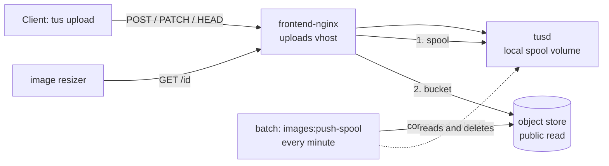

# Images: the upload spool and the object store

Uploaded photos go to a **local spool** on the Docker host and are moved to an
S3-compatible **object store** within a minute or two. Upload ids, upload URLs, the API
and the apps know nothing about where a file is kept. The NFS share that used to hold
the uploads has been copied into the bucket in full and retired.

Bucket names, hosts and keys are in the ops team's notes, never here.

## How it works



- **Writes.** Every tus protocol request goes to `tusd`, which writes `<id>` and
  `<id>.info` into the `tusd-spool` volume. tusd knows nothing about the bucket.
- **The pusher** (`images:push-spool`, scheduled every minute in `batch-prod` while
  `IMAGE_STORE_ENABLED` is on) treats an upload as complete when the bytes are exactly as
  long as the `.info` declared and have not changed for a grace period. It stores the
  bytes with a sniffed `Content-Type`, confirms the bucket reports the same length, and
  only then deletes the local files. The `.info` never leaves the host. Uploads that
  never complete are deleted after a day.
- **Reads.** A `GET` for an upload id is answered by the first place that has it: the
  spool (a local stat), then the bucket. A trailing slash after the id is accepted,
  because partner sites send one. The bucket is the last place, so its answer is what
  the resizer gets: a 404 means the upload exists nowhere.

Everything that decides where a file lives is in `frontend-nginx.conf` (the uploads
vhost) and `iznik-batch/app/Services/ImageStore/`.

## Configuration

The write side is in the batch secrets (`IMAGE_STORE_*`, see `.env.background.example`).
The front nginx needs only the bucket's public URL, `IMAGE_STORE_PUBLIC_URL` in the
compose `.env` (see `.env.example`); the edge override refuses to start without it.

The bucket has public read on and listing off. The access key can read and write that
bucket and nothing else. Both are set in the provider's console or through its Core API
(`object_storage` scope; the cluster is looked up by region, `uk-lon-1`). Public read is
a bucket setting there, not an S3 ACL or policy, which the provider's S3 interface does
not accept.

## Checks

From inside `batch-prod`:

```
php artisan images:object-store-check
```

It writes a probe, reads it back **anonymously** at the public URL, and deletes it. Run
it after any change to the bucket or the key. A bucket that has lost public read answers
401 or 403 to every image the spool no longer holds, with nothing in any log naming the
cause. The same check runs every ten minutes with `--report`, which raises
`ObjectStoreUnavailable` in Sentry when it fails.

It writes a probe, reads it back **anonymously** at the public URL, and deletes it. Run
it after any change to the bucket or the key. A bucket that has lost public read answers
403 to every image the spool no longer holds.

```
php artisan images:push-spool --dry-run
```

Shows what the next pass would push or clean up. `storage/logs/cron/images_push-spool.log`
has each scheduled pass; `Failed` must be 0. `Waiting (grace)` and `Incomplete` are normal.

## If the bucket goes dark

Every upload that is not in the spool answers with whatever the bucket says (401, 403,
404, a 5xx) until the bucket answers again. Nothing can be done about them locally; the
pusher deleted each local copy only after the bucket confirmed it held the object. The
uploads of the last minute or two are still in the spool and keep serving from there.
The delivery cache serves stale copies where it has them.

The pusher stops at the first object that meets an unavailable store, reports
`ObjectStoreUnavailable` to Sentry, and counts nothing as failed: uploads stay in the
spool, where the chain serves them. The scheduled `images:object-store-check --report`
raises the same error within ten minutes. When the bucket is back,
`images:object-store-check` by hand must print `OK` before anything else; the next pusher
pass then drains the spool.

To stop pushing on purpose, set `IMAGE_STORE_ENABLED=false` and recreate `batch-prod`.
Uploads then stay in the spool and are served from there indefinitely.

## The old share

It is gone and nothing reads from it. Everything on it is in the bucket: the files the
upload tables refer to, and the files no row points to - the originals of photos the old
archiver moved to Azure (the row keeps `archived = 1` and loses its tusd id), photos
removed from posts, purged drafts and pending posts, and uploads never attached to
anything. Partner sites keep those URLs (the `:8080` form), mail clients proxy the images
in old digests, and link previews are cached, so they were all copied. What did not
come across: `.info` bookkeeping, stale `.lock` files, and rows whose file was on no store
even before the move (photos deleted years ago, rows that never had a file).

If a rise in 404s from the uploads vhost ever appears, it is an upload URL that nothing
covered; the id is in the nginx access log and there is no other copy of the file.

## What it costs

Object storage is billed on use: a small monthly base that includes 250 GB and 1 TB of
outbound transfer, then a few pence per GB. Uploading is free, and the delivery cache in
front means the bucket only serves cache misses.
