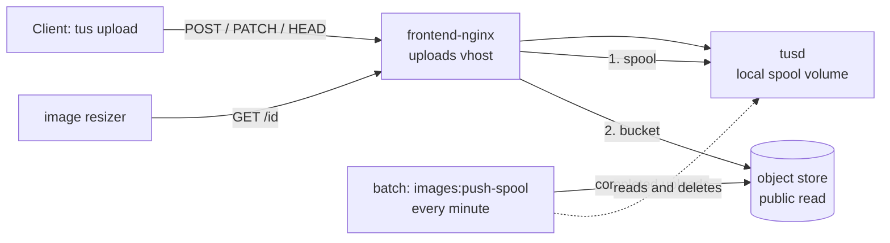

# Images: the upload spool and the object store

Uploaded photos go to a **local spool** on the Docker host and are moved to an
S3-compatible **object store** within a minute or two. Upload ids, upload URLs, the API
and the apps know nothing about where a file is kept.

Bucket names, hosts and keys are in the ops team's notes, never here.

## How it works



- **Writes.** Every tus protocol request goes to `tusd`, which writes `<id>` and
  `<id>.info` into the `tusd-spool` volume. tusd knows nothing about the bucket.
- **The pusher** (`images:push-spool`, scheduled every minute in `batch-prod` while
  `IMAGE_STORE_ENABLED` is on) treats an upload as complete when the bytes are exactly as
  long as the `.info` declared and have not changed for a grace period. It stores the
  bytes with a sniffed `Content-Type`, confirms the bucket reports the same length, and
  only then deletes the local files. The `.info` never leaves the host. Uploads that
  never complete are deleted after a day.
- **Reads.** A `GET` for an upload id is answered from the spool if the file is still
  there, otherwise from the bucket. The bucket's answer is passed straight back, so a
  404 means the upload exists nowhere.

Everything that decides where a file lives is in `frontend-nginx.conf` (the uploads
vhost) and `iznik-batch/app/Services/ImageStore/`.

## Configuration

The write side is in the batch secrets (`IMAGE_STORE_*`, see `.env.background.example`).
The front nginx needs only the bucket's public URL, `IMAGE_STORE_PUBLIC_URL` in the
compose `.env` (see `.env.example`); the edge override refuses to start without it.

The bucket has public read on and listing off. The access key can read and write that
bucket and nothing else. Both are set in the provider's console or through its Core API
(`object_storage` scope; the cluster is looked up by region, `uk-lon-1`). Public read is
a bucket setting there, not an S3 ACL or policy, which the provider's S3 interface does
not accept.

## Checks

From inside `batch-prod`:

```
php artisan images:object-store-check
```

It writes a probe, reads it back **anonymously** at the public URL, and deletes it. Run
it after any change to the bucket or the key. A bucket that has lost public read answers
403 to every image the spool no longer holds.

```
php artisan images:push-spool --dry-run
```

Shows what the next pass would push or clean up. `storage/logs/cron/images_push-spool.log`
has each scheduled pass; `Failed` must be 0. `Waiting (grace)` and `Incomplete` are normal.

## If the bucket is unreachable

Uploads carry on: they land in the spool, and reads of new photos are served from there.
The pusher leaves everything in place and retries every minute, so the spool grows until
the bucket is back. Photos already moved to the bucket fail their origin fetch, and the
delivery cache serves stale copies where it has them. Nothing needs doing beyond getting
the bucket back; check afterwards that the spool drains.

To stop pushing on purpose, set `IMAGE_STORE_ENABLED=false` and recreate `batch-prod`.
Uploads then stay in the spool and are served from there indefinitely.

## What it costs

Object storage is billed on use: a small monthly base that includes 250 GB and 1 TB of
outbound transfer, then a few pence per GB. Uploading is free, and the delivery cache in
front means the bucket only serves cache misses.
