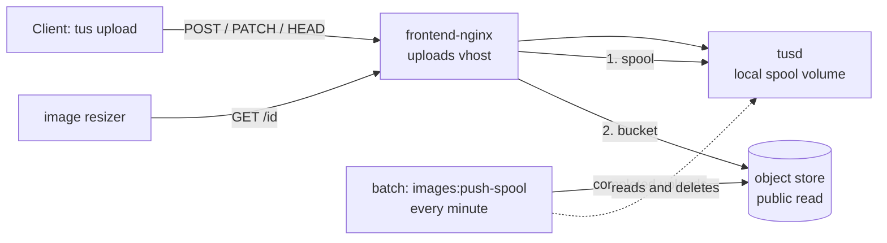

# Images: moving the upload store from NFS to object storage

Uploaded photos used to be written by tusd straight onto a cloud NFS share, one flat
directory of about two million files. They now go to a **local spool** on the Docker
host and are moved to an S3-compatible **object store** within a minute or two. The old
share has been copied into the bucket in full and retired. Nothing about upload ids,
upload URLs, the API or the apps changed.

This page is the shape of the change and the order of operations. Host names, bucket
names and keys are in the ops team's notes, never here.

## How it works



- **Writes.** Every tus protocol request goes to `tusd`, which writes `<id>` and
  `<id>.info` into the `tusd-spool` volume. tusd knows nothing about the bucket.
- **The pusher** (`images:push-spool`, scheduled every minute in `batch-prod`) treats an
  upload as complete when the bytes are exactly as long as the `.info` declared and
  have not changed for a grace period. It stores the bytes with a sniffed
  `Content-Type`, confirms the bucket reports the same length, and only then deletes
  the local files. The `.info` never leaves the host. Uploads that never complete are
  deleted after a day.
- **Reads.** A `GET` for an upload id is answered by the first place that has it: the
  spool (a local stat), then the bucket. A trailing slash after the id is accepted,
  because partner sites send one. The bucket is the last place, so its answer is what
  the resizer gets.
- **The migrator** (`images:migrate-legacy`) is the tool that moved the old NFS share into
  the bucket: it walks the eleven tables that hold upload ids, or a listing of file names,
  and copies what the bucket lacks, keeping its place per source in
  `image_store_migration`. `--status` still shows the final counts of the move; `--verify`
  re-walks the tables and reports anything the bucket lacks.

Everything that decides where a file lives is in `frontend-nginx.conf` (the uploads
vhost) and `iznik-batch/app/Services/ImageStore/`.

## Before the cutover

1. Enable object storage for the organisation in region `uk-lon-1`, create the bucket
   with `public_read` on (and `public_list` off), and create an access key that can
   write to it. Public access is a bucket setting in the provider's own API, not an S3
   ACL or policy, which that provider's S3 interface does not accept. The console does
   all three, or the Core API does with a token holding the `object_storage` scope:

   | Step | Call |
   |---|---|
   | Enable the service (starts the monthly base fee) | `POST organizations/:organization/object_storage/:object_storage_cluster` |
   | Create the bucket, `access_control_list.public_read: true` | `POST organizations/:organization/object_storage/:object_storage_cluster/buckets` |
   | Create an access key | `POST organizations/:organization/object_storage/:object_storage_cluster/access_keys` |
   | Get its secret, shown once | `POST object_storage/access_keys/:access_key/generate_credentials` |

   The cluster is looked up by `object_storage_cluster[region]=uk-lon-1`. The bucket's
   `public_url` field is the value for `IMAGE_STORE_PUBLIC_URL`. No CORS origins are
   needed: only the image resizer reads the bucket, server to server.
2. On the Docker host, add the write-side settings to the batch secrets file and the
   public bucket URL to the compose `.env` (see `.env.background.example` and
   `.env.example`). Leave `IMAGE_STORE_ENABLED` and `IMAGE_STORE_MIGRATE_ENABLED` off.
3. Apply the production SQL for the cursor table
   (`2026_09_28_000001_create_image_store_migration_table_migration.sql`).
4. Prove the bucket from inside the batch container:

   ```
   php artisan images:object-store-check
   ```

   It writes a probe, reads it back **anonymously** at the public URL, and deletes it.
   A bucket that is not public answers 401 or 403; nginx falls through to the legacy
   share, and every image that exists only in the bucket 404s with nothing in any log
   naming the cause. Do not go on until this prints `OK`. Once the store is enabled the
   same check runs every ten minutes with `--report`, which raises
   `ObjectStoreUnavailable` in Sentry when it fails.

## Cutover

Each step is reversible on its own. The upload path is interrupted for the few seconds
tusd takes to restart; a client mid-upload gets a 404 on its next PATCH and tus-js-client
starts the upload again by itself.

1. Pull the change on the Docker host and bring up the edge services and `batch-prod`
   (`tusd` gains the spool volume; `frontend-nginx` gets the read chain and the bucket
   URL; `batch-prod` gains the spool). Recreating `batch-prod` is a production restart of
   the scheduler: do it at a quiet time and with approval.
2. Upload a photo through the site. Check it is served (`X-Cache-Status: MISS` on the
   first delivery fetch), that the spool holds it, and that an old post's photo still
   renders (that is the legacy hop).
3. Set `IMAGE_STORE_ENABLED=true` in the batch secrets and restart `batch-prod`. Within
   two minutes the spool should be empty of completed uploads and the bucket should hold
   the test photo. Then `docker logs` the `frontend-nginx` container for a GET of that id
   and confirm it was answered from the bucket (the request no longer reaches `tusd`).
4. Watch `storage/logs/cron/images_push-spool.log` for a day. `Failed` must stay at 0;
   `Waiting (grace)` and `Incomplete` are normal.

## If the bucket goes dark

Every upload that is not in the spool answers with whatever the bucket says (401, 403,
404, a 5xx) until the bucket answers again. Nothing can be done about them locally; the
pusher deleted each local copy only after the bucket confirmed it held the object. The
uploads of the last minute or two are still in the spool and keep serving from there.

The pusher stops at the first object that meets an unavailable store, reports
`ObjectStoreUnavailable` to Sentry, and counts nothing as failed: uploads stay in the
spool, where the chain serves them. The scheduled `images:object-store-check --report`
raises the same error within ten minutes. When the bucket is back,
`images:object-store-check` by hand must print `OK` before anything else; the next pusher
pass then drains the spool.

## The old share

Everything on it is in the bucket. The move had two parts, both run with
`images:migrate-legacy` from `batch-prod`, and `--status` still shows the final counts:

- **What the tables refer to.** The eleven tables that hold upload ids were walked by
  primary key and every referenced file copied; `--verify` then re-walked them. Rows
  whose file was on neither store are listed as missing by the verify and were already
  absent before the move: photos deleted years ago, and rows that never had a file.
- **What no table refers to.** The share also held files no row points to: the originals
  of photos the old archiver moved to Azure (the row keeps `archived = 1` and loses its
  tusd id), photos removed from posts, purged drafts and pending posts, and uploads never
  attached to anything. Partner sites keep those URLs (the `:8080` form), mail clients
  proxy the images in old digests, and link previews are cached, so they were copied too,
  from a listing of the share (`--listing=<file>`, one tusd id per line, which keeps its
  place by line number under the source `listing:<file name>`).

What went with the share: `.info` bookkeeping, stale `.lock` files, and nothing else.

If a rise in 404s from the uploads vhost ever appears, it is an upload URL that neither
the tables nor the listing covered; the id is in the nginx access log and there is no
other copy of the file.

## What to expect on the bill

Object storage is billed on use at a fraction of the file storage rate, plus a small
base fee that includes a transfer allowance. The saving arrives when the volume is
deleted, not as files are copied, which is why the copy never deletes individual files.
