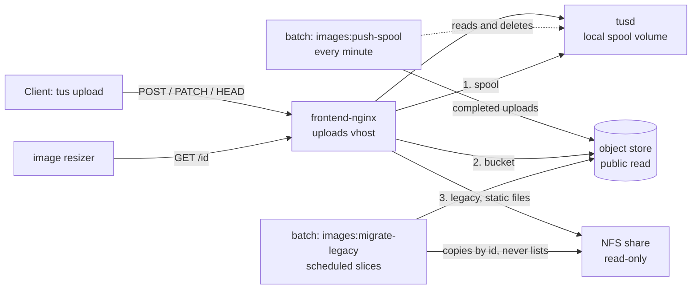

# Images: moving the upload store from NFS to object storage

Uploaded photos used to be written by tusd straight onto a cloud NFS share, one flat
directory of about two million files. They now go to a **local spool** on the Docker
host and are moved to an S3-compatible **object store** within a minute or two. The old
share is read-only and is being copied across in the background. Nothing about upload
ids, upload URLs, the API or the apps changed.

This page is the shape of the change and the order of operations. Host names, bucket
names and keys are in the ops team's notes, never here.

## How it works



- **Writes.** Every tus protocol request goes to `tusd`, which writes `<id>` and
  `<id>.info` into the `tusd-spool` volume. tusd knows nothing about the bucket.
- **The pusher** (`images:push-spool`, scheduled every minute in `batch-prod`) treats an
  upload as complete when the bytes are exactly as long as the `.info` declared and
  have not changed for a grace period. It stores the bytes with a sniffed
  `Content-Type`, confirms the bucket reports the same length, and only then deletes
  the local files. The `.info` never leaves the host. Uploads that never complete are
  deleted after a day.
- **Reads.** A `GET` for an upload id is answered by the first place that has it: the
  spool (a local stat), then the bucket, then the legacy share, bound read-only into the
  front nginx and served as plain static files (not through tusd, which creates a lock
  file even on a read). Because the URL never says where a file is, the copy of the old
  store is invisible to members and can take as long as it needs.
- **The migrator** (`images:migrate-legacy`) walks the eleven tables that hold upload
  ids by primary key, keeps a cursor per source in `image_store_migration`, and copies
  each referenced file that the bucket does not already hold at the right length. It
  runs in short scheduled slices with a bandwidth cap, never lists the share (a listing
  starves uploads) and never deletes from it. `--verify` re-walks and reports anything
  missing.

Everything that decides where a file lives is in `frontend-nginx.conf` (the uploads
vhost) and `iznik-batch/app/Services/ImageStore/`.

## Before the cutover

1. In the cloud console: enable object storage, create the bucket, make it publicly
   readable, and create an access key. (The provider exposes no ACL or policy through
   the S3 API; public access and CORS are console settings.)
2. On the Docker host, add the write-side settings to the batch secrets file and the
   public bucket URL to the compose `.env` (see `.env.background.example` and
   `.env.example`). Leave `IMAGE_STORE_ENABLED` and `IMAGE_STORE_MIGRATE_ENABLED` off.
3. Apply the production SQL for the cursor table
   (`2026_09_28_000001_create_image_store_migration_table_migration.sql`).
4. Prove the bucket from inside the batch container:

   ```
   php artisan images:object-store-check
   ```

   It writes a probe, reads it back **anonymously** at the public URL, and deletes it.
   A bucket that is not public answers 403; nginx would hide that by falling through to
   the legacy share, and every new image would 404 with nothing in any log naming the
   cause. Do not go on until this prints `OK`.

## Cutover

Each step is reversible on its own. The upload path is interrupted for the few seconds
tusd takes to restart; a client mid-upload gets a 404 on its next PATCH and tus-js-client
starts the upload again by itself.

1. Pull the change on the Docker host and bring up the edge services and `batch-prod`
   (`tusd` gains the spool volume and loses the NFS bind; `frontend-nginx` gets the
   read chain, the bucket URL and the share read-only; `batch-prod` gains the spool and
   the read-only share). Recreating `batch-prod` is a production restart of the
   scheduler: do it at a quiet time and with approval.
2. Upload a photo through the site. Check it is served (`X-Cache-Status: MISS` on the
   first delivery fetch), that the spool holds it, and that an old post's photo still
   renders (that is the legacy hop).
3. Set `IMAGE_STORE_ENABLED=true` in the batch secrets and restart `batch-prod`. Within
   two minutes the spool should be empty of completed uploads and the bucket should hold
   the test photo. Then `docker logs` the `frontend-nginx` container for a GET of that id
   and confirm it was answered from the bucket (the request no longer reaches `tusd`).
4. Watch `storage/logs/cron/images_push-spool.log` for a day. `Failed` must stay at 0;
   `Waiting (grace)` and `Incomplete` are normal.

**Rollback** at this point: set `IMAGE_STORE_ENABLED=false`, copy the spool's files onto
the share (`docker cp` the spool volume's contents into the NFS mount; ids are unique so
nothing collides), and put the previous compose files back. Objects already in the
bucket are also still served by the previous configuration only if you keep the nginx
read chain; keeping it is harmless.

## The legacy copy

1. Set `IMAGE_STORE_MIGRATE_ENABLED=true` and restart `batch-prod`. The migrator runs
   every five minutes for four minutes at 10 MB/s by default (`IMAGE_STORE_MIGRATE_*`).
   1.1 TB at that rate is roughly 30 hours of transfer; expect the whole copy to take a
   few days of slices. It is safe to stop and start at any time.
2. Progress:

   ```
   php artisan images:migrate-legacy --status
   ```

   `Missing src` counts rows whose file is not on the share at all (deleted years ago,
   or a row that never had one); those are logged and are not a fault of the copy.
   `Failed` should stay at 0; a non-zero count means the bucket refused something and
   the rows will be retried on a `--reset` of that source.
3. When every source shows a copy-done time, turn the schedule off
   (`IMAGE_STORE_MIGRATE_ENABLED=false`) and verify:

   ```
   php artisan images:migrate-legacy --verify --time-budget=3600
   ```

   Run it until it reports `finished`; it resumes from its own cursor. It must list
   nothing missing. Anything it does list is a row whose file is on neither store.

## Retiring the share

Only after a clean verify:

1. Remove the `@legacy_store` location and the `error_page 403 404 = @legacy_store`
   line from the uploads vhost in `frontend-nginx.conf`, both `/srv/tusd-data` binds
   from `docker-compose.override.edge.yml`, and the `tusd-legacy` volume and its mount
   from `docker-compose.yml`. Bring the edge services up again.
2. Watch delivery for a day: a rise in 404s from the uploads vhost means a reference the
   verify did not cover.
3. Unmount the share on the host and delete the file storage volume in the cloud
   console. Files the database did not reference (abandoned uploads, deleted posts) go
   with it; nothing could reach them.

## What to expect on the bill

Object storage is billed on use at a fraction of the file storage rate, plus a small
base fee that includes a transfer allowance. The saving arrives when the volume is
deleted, not as files are copied, which is why the copy never deletes individual files.
