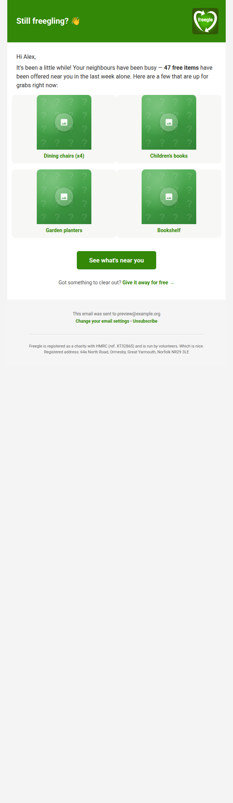
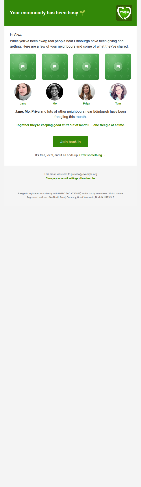
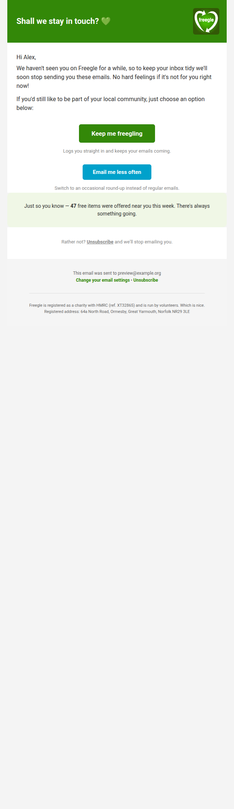

# Localised re-engagement emails

**Branch:** `feature/reengagement-mails` · **Status:** built, dark by default · 2026-06-14

## Why

Freegle already has a re-engagement flow — the `engage` system (`mail:engage`,
`EngageEmailService`, templates `missing` / `inactive`). But it is **late and
generic**:

- It only fires at the very end of a user's life: "AtRisk" ~7 days before the
  182.5-day inactivity cutoff, and "Inactive" once they're past it.
- The copy is "We miss you" / "We'll stop emailing you soon" — no local content,
  no nearby activity, no sense of the community the user is drifting away from.

Industry + charity-sector research (see sources below) is consistent that the
biggest re-engagement wins come **early**, from **local/personalised content**
("what's happening near you") rather than guilt, with a short **sequence**
ending in a preference choice, then suppression.

This change adds that earlier, localised sequence **alongside** the existing
engage system, graduated across the lapse. After the upper bound the existing
engage AtRisk/Inactive sunset takes over, so the two never double-mail the same
lapse.

## Research summary

**Timing — intervene early and graduate, don't wait months.** A single late
trigger misses the point: most of the drop-off happens in the first few weeks,
and re-engaging while users are *on the way out* reactivates markedly better than
reviving long-dormant ones. An early, gentle nudge recovers a meaningful share
because many early lapses are accidental, whereas very late attempts barely
register and risk spam traps. Modern practice uses **behavioural / lifecycle
triggers** (declining engagement, stage-based), not one static window; episodic
products warrant an early first touch. We therefore **graduate** the three stages
across the lapse (early → mid → late) rather than bunching them, ending before
the engage sunset.

**Sequence/deliverability** (Mailchimp, Klaviyo, Litmus, Spamhaus, Mailgun,
beehiiv, Charity Digital): a **3-email sequence**, **suppress** non-responders
after to protect deliverability (Gmail/Yahoo bulk-sender spam-rate caps), exclude
lapsed users from the regular digest while the sequence runs, and measure
clicks/logins not opens (Apple MPP inflates opens).

**Messaging** (Nonprofit Marketing Guide, Bloomerang, Campaign Monitor, Litmus):
lead with concrete **local impact** ("items offered near you this week", "weight
kept out of landfill near you"), not "we miss you". One clear CTA. Offer a
**frequency downgrade** before unsubscribe. Plain, accessible, mobile-first
design for a broad demographic. RFC 8058 one-click unsubscribe.

## Design

A new **`reengage`** email family — kept separate from the live `engage` system
so it can ship dark without touching production sending.

**The sequence** (templates under `resources/views/emails/mjml/reengage/`):

1. **`nearby`** — "what's been freegled near you": a count of free items offered
   near the user this week + live item cards. CTA *See what's near you*.
2. **`impact`** — "your community has been busy": a **collage** of real
   neighbours (avatars + first names) and the things they've shared (item
   photos), instead of abstract stat counters — concrete and human. CTA *Join
   back in*.
3. **`preferences`** — "shall we stay in touch?": honest opt-in confirmation +
   gentle sunset notice. Primary *Keep me freegling* (auto-login), secondary
   *Email me less often*, clear unsubscribe. Doubles as a GDPR consent refresh.

All three use the shared MJML head/footer partials and brand tokens (clean,
attractive, the birthday email as the visual bar), have plain-text alternatives,
and set RFC 8058 `List-Unsubscribe` headers.

**Cadence / state.** Candidate once `lastaccess` is ≥ `trigger_days` (default
**30**) and < `max_days` (175). Stages are spaced ≥ `stage_gap_days` (default
**45**), so a clean lapse receives the three stages at roughly **30 / 75 / 120
days** inactive — early gentle nudge → community pull → opt-in/sunset. A user's
position is derived from `reengage` rows newer than their `lastaccess`, so **any
login resets the sequence for free** (their lastaccess jumps past every send).
After stage 3 with no re-engagement the sequence is marked `Suppressed`.

The trigger is on **login** inactivity (`users.lastaccess`). Many freeglers read
digests without logging in, so login-gap overstates disengagement; the first
touch is deliberately a soft, value-led "what's near you" (low annoyance risk),
and the trigger is env-tunable. Refining to an **email-engagement** signal
(non-opens/clicks of recent digests) is the recommended pre-ramp improvement.

**Localisation.** Lat/lng waterfall (`settings.mylocation` → `lastlocation`);
the place label prefers the user's picked location, then their **Freegle group's
town** (curated/recognizable — the raw `lastlocation` name is often a road or
postcode fragment like "WV3"), then a guarded location name, else "your area";
nearby OFFERs (item photos) via
the existing `NearbyOffersService`; the stage-2 collage uses recent nearby
posters who have uploaded an avatar (first name + profile photo — the same
public wall data shown in-app). Everything degrades gracefully — no location, no
avatars, or no photos still yields a sensible email.

**Eligibility / suppression** mirrors the engage flow: approved Freegle
membership, per-group engagement opt-out honoured, `deleted`/`bouncing`/
`onholidaytill`/`simplemail=None` all respected.

## Dark-ship gating

Two gates, both off by default:

- `FREEGLE_MAIL_ENABLED_TYPES` must contain `Reengage` (added to docker-compose;
  kill-switch).
- `FREEGLE_REENGAGE_ALLOWLIST` — `''` = nobody (default), `'*'` = everyone,
  else a comma-separated pilot list of recipient addresses.

Tunables: `FREEGLE_REENGAGE_TRIGGER_DAYS` (30), `_STAGE_GAP_DAYS` (45),
`_MAX_DAYS` (175).

## Files

- Migration `2026_06_14_120000_create_reengage_table.php`
- `config/freegle.php` — `reengage` block
- `app/Services/ReengageService.php` — orchestration + sequence logic
- `app/Services/ReengageContentService.php` — localised content
- `app/Mail/Reengage/ReengageMail.php`
- `resources/views/emails/mjml/reengage/{nearby,impact,preferences}.blade.php`
- `resources/views/emails/text/reengage/{nearby,impact,preferences}.blade.php`
- `app/Console/Commands/Mail/SendReengageEmailsCommand.php` — `mail:reengage`
- `routes/console.php` — daily 15:30 schedule
- Tests: `tests/Unit/Mail/ReengageMailRenderTest.php`,
  `tests/Feature/Mail/ReengageEmailsCommandTest.php`

## Visual review

`php artisan mail:reengage --preview=you@example.org` sends one of each stage
(sample data) to mailpit, bypassing the gates. Rendered via headless Chrome
(GPU off) against the mailpit HTML:

| Stage 1 — nearby | Stage 2 — impact | Stage 3 — preferences |
|---|---|---|
|  |  |  |

(Sample data shown — area name, counts and items are illustrative.)

## Rollout

1. Merge (dark — nothing sends).
2. **Before enabling: exclude in-sequence users from the regular unified digest**
   (deliverability best practice — do not double-mail). Not done here to keep the
   live digest untouched; this is the #1 prerequisite for going live.
3. Pilot: set `FREEGLE_REENGAGE_ALLOWLIST` to a couple of staff addresses; watch.
4. Ramp the allowlist; monitor unsubscribe/complaint rates.
5. Consider click/login-based success metrics on the `reengage` table.

The trigger and window were sanity-checked against live data (kept out of this
public doc): the lapse rate is steepest in the first weeks and the early window
holds a substantial, reachable cohort — confirming an early, graduated cadence
over a single late trigger.

## Key sources

**Timing/early intervention:** DesignRush 2026 behavioral-triggers benchmark;
Bloomreach reengagement evolution; Memberlytic lapsed-member playbook; Mailflow
Authority (re-engagement timing & sunset); Braze win-back.
**Sequence/deliverability/messaging:** Mailchimp win-back; Klaviyo list-cleaning;
Litmus deliverability + 2025 State of Email (MPP); Spamhaus sunset policy;
Mailgun frequency-indexed thresholds; beehiiv re-engagement framework;
Charity Digital + Nonprofit Marketing Guide (charity framing); Campaign Monitor
(button CTA uplift); Digioh (preference-centre unsubscribe reduction).
