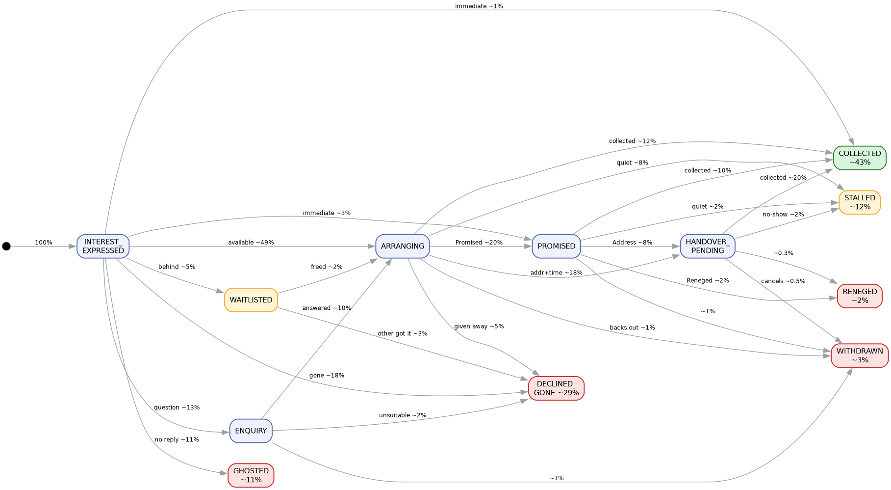
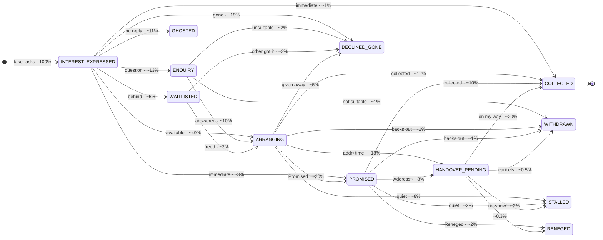
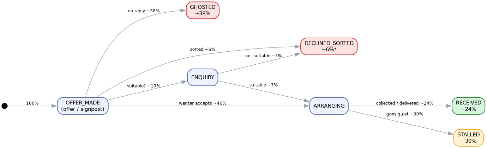
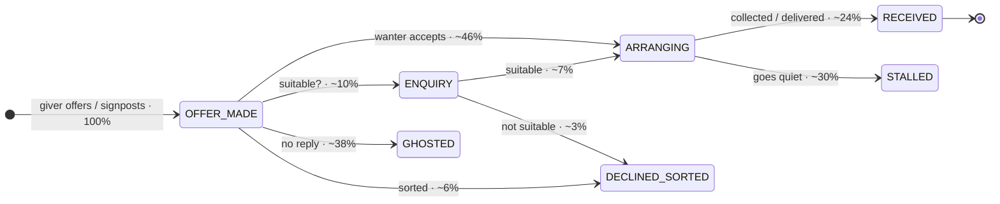

# Freegle Member-to-Member Chat Flow

Empirical state machines of `User2User` chats between two freeglers, suitable for
[ai-flower](https://github.com/freegle/ai-flower). Derived from the **live production database**
(via the V2 live API tunnel, port 11234) by analysing **~40,000 new conversations over one month
(2026-05)** and reading ~260 full conversations.

**Offer and Wanted chats behave differently, so each has its own flow:**

| | initiated by | opener role | files |
|---|---|---|---|
| **OFFER** (~92% of chats) | taker replies to an offered item | taker asks the **giver** | `freegle-chat-flow-offer.png` · `…-offer-workflow.json` |
| **WANTED** (~8% of chats) | giver replies offering an item | **giver** offers the wanter | `freegle-chat-flow-wanted.png` · `…-wanted-workflow.json` |

It complements the offerer-side concierge FSM in
[`active/freegle-helper-concierge.md`](active/freegle-helper-concierge.md) (one offerer managing
many repliers in a bulk event); these model the 1:1 conversation itself.

## The message-type spine

`chat_messages.type` encodes most of the machine. The giver (item owner) issues the system events
`Promised`, `Address`, `Reneged`; `Completed` can be marked by either side. Month distribution
(User2User): `Default` 177k · `Interested` 56k · `Completed` 32k · `Promised` 10k · `Image` 2.6k ·
`Address` 2.3k · `Reneged` 1.5k · `Reminder` 790 · `Nudge` 155.

## `Completed` ≠ success — the key correction

`Completed` only means the **post was closed**. It does **not** prove the replier in *this* chat got
the item. The common terse `Interested → Completed` with no real giver reply is the automatic
*"sorry, this has been taken"* broadcast — the item went to **someone else**. Even a two-sided chat
that ends *"sorry, gone to someone else"* is **not** a collection. Counting only genuine
handover-to-this-replier gives the honest split below.

## Outcome distribution (measured)

| Outcome | **OFFER** | **WANTED** |
|---|---:|---:|
| ✅ Collected / received by this replier | **~43%** | **~24%** |
| ❌ Gone elsewhere / declined | **~29%** | ~6%* |
| 👻 Ghosted (no reply) | ~11% | **~38%** |
| ⏸️ Stalled (some latent success) | ~15% | **~30%** |
| ↩️ Reneged | ~2% | ~0% |

\* Wanted declines are under-measured — many "already sorted" cases simply ghost, so the true
Wanted decline rate is higher and the ghost rate correspondingly softer. Wanteds barely use the
`Promised`/`Address`/`Reneged` machinery (it's offerer-side), mark `Completed` far less (~22% vs
~52%), ghost much more (the wanter is often already sorted), and ~16% of opener messages are
**signposts** (pointing the wanter elsewhere) rather than an actual offer; ~9% offer **delivery**.

Edge labels below are the **approximate share of conversations** taking that arm; terminal-state
totals are measured, intermediate splits are estimates (`~`).

---

## OFFER flow — taker requests a given item

Each conversational state is its own box (matching the `freegle-helper-concierge` FSM granularity):
`INTEREST_EXPRESSED → ARRANGING → PROMISED → HANDOVER_PENDING → COLLECTED` is the happy-path spine;
detours (`ENQUIRY`, `WAITLISTED`) rejoin it and off-ramps drop to the terminal outcomes.

---

## WANTED flow — replier offers an item to the wanter

The Wanted flow is simpler — no `Promised`/`Address`/`Reneged`, no waitlist machinery — but ghosts
far more. Two Wanted-only flavours sit inside the boxes: ~16% of `OFFER_MADE` openers are
**signposts** (pointing the wanter elsewhere) rather than an actual offer, and ~9% of `ARRANGING`
handovers are **delivery** (the giver drops it round) instead of collection.

---

## Validation

A fresh random sample of 130 conversations was read and classified against the model: **130/130
fit**, no conversation needed a state outside it (a few were still in-progress at snapshot). Wanted
conversations were then sampled separately to derive the distinct Wanted flow. Refinements folded
in: a small share open with a plain `Default`; a no-show auto-`Reneged` can reverse into
`ARRANGING`; multi-item chats loop the arrange→collect arc per item; rude/mismatch rejections fold
into `DECLINED_GONE`/`DECLINED_SORTED`.

## How this was produced

1. Live DB reached read-only through the V2 live API tunnel (`apiv2-live`, `db-live:11234`).
2. Profiled `chat_messages.type` for `User2User` chats `created >= 2026-05-01`, split by Offer/Wanted.
3. Bucketed all chats, **separating genuine handover-to-this-replier from bare `Completed` closures
   and "gone elsewhere" declines** so success is never over-counted.
4. Stratified-sampled and read ~260 full conversations across both post types and every bucket.

> Privacy note: the raw conversation samples contain member PII (names, addresses, phone numbers)
> and were deliberately **not** persisted. Only this PII-free aggregate analysis and the workflow
> definitions are kept.
