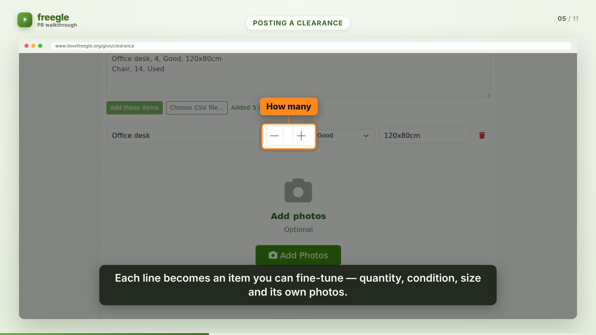

# PR Walkthrough Video Generator

Turn a GitHub PR into a calm, **annotated walkthrough video at human viewing speed** — the
opposite of a Playwright recording that whizzes through the UI to satisfy an assertion. The
video points at the changed screens, captions what is happening, and tells the story of the
feature so a reviewer can *see* what changed without reading the diff.

Built with [Remotion](https://remotion.dev) (React → video). The example is
[Freegle/Iznik #618](https://github.com/Freegle/Iznik/pull/618) — bulk-offer "clearance"
listings.

> **Scope rule:** a walkthrough shows **externally-visible function only** — what a person
> using the product sees and does. No code, data models, APIs, migrations or diff stats.



## How it works

```
gh PR ──▶ fetch ──▶ analyze ──▶ storyboard.json ──▶ mask PII ──▶ render ──▶ walkthrough.mp4
```

Three decoupled stages around a single, validated **storyboard** (the "script"):

| stage | file | does |
|---|---|---|
| **fetch** | `src/fetch.mjs` | PR metadata + diff (`gh`), and downloads the screenshots referenced in the PR body into `examples/pr-<n>/assets/`. |
| **analyze** | `src/analyze.mjs` | Produces `storyboard.json` — the ordered scenes, captions and timed callouts. This is the step that *decides what to highlight*. |
| **render** | `src/render.mjs` | Bakes PII masks, stages the masked assets, validates the storyboard, and renders the MP4 with Remotion. |

### One command

```bash
node pr-walkthrough.mjs 618 --repo Freegle/Iznik
# → examples/pr-618/out/pr-618-walkthrough.mp4
```

### Or stage by stage

```bash
node src/fetch.mjs   618 --repo Freegle/Iznik
node src/analyze.mjs --example examples/pr-618           # validates the storyboard
node src/render.mjs  --example examples/pr-618           # masks + renders
npm run studio                                            # live-preview/edit in Remotion Studio
```

## The storyboard (the script you can review against the PR)

`examples/pr-618/storyboard.json` is plain JSON, validated by `src/storyboard-schema.mjs`.
Coordinates (`focus`, callout `box`, `pan`) are **fractions (0..1) of the screenshot's
natural size**, so they are resolution-independent and authorable by eye. Scene types:

- `title` / `outro` — branded cards.
- `narration` — a heading + bullets + caption (framing / "why"; text only).
- `screenshot` — the substance: a screenshot with a `focus` zoom (or `pan:"down"` scroll),
  a lower-third `caption`, and `callouts` that reveal **sequentially**, each pointing at a
  control with a short label.

Because the storyboard is just data, you can read it against the PR and judge whether it does
the brief *before* spending a render — and tweak a caption or a callout and re-render in one
command.

### Who writes the storyboard

- **`--analyzer manual`** (default) uses the committed `storyboard.json`. The 618 example was
  authored by reading the diff + screenshots directly — the analysis the brief asks for — and
  is kept as the golden reference.
- **`--analyzer claude`** builds the prompt in `prompts/analyze.md` from the PR material and
  asks the `claude` CLI to write the storyboard. It is **opt-in** (it spends tokens) and never
  runs unless you ask for it.

## PII masking

Real PRs include screenshots with real people's data. `examples/pr-<n>/masks.json` lists
regions (fractions of the image) to **pixelate / blur / box**, and `src/imageutil.py`
**bakes** them into `*.masked.png` copies. The storyboard only ever references the masked
copies, and the renderer stages only those into `public/` — so the sensitive pixels never
reach the video frames (they are not merely covered with a CSS box).

To measure regions, overlay a labelled grid and read off the fractions:

```bash
python3 src/imageutil.py grid examples/pr-618/assets/recipient-interest.png /tmp/grid.png
python3 src/imageutil.py mask examples/pr-618        # bake the masked copies
```

For 618 the poster's avatar and name are pixelated; the public town/postcode-district shown
by design on Freegle is left as-is.

## Storage & embedding in the PR

These walkthroughs are mostly static screens, so H.264 compresses them to a **few MB** — not
"enormous". Rendered MP4s still don't belong in git:

- **Recommended (inline player):** drag-drop `walkthrough.mp4` into the PR description. GitHub
  hosts it on `user-attachments` and renders a `<video>` player inline. `src/publish.mjs`
  prints the exact markdown to paste.
- **Automatable:** `node src/publish.mjs --example examples/pr-618 --release <repo>` uploads the
  MP4 as a GitHub Release asset and prints a stable URL.
- **Git LFS:** `.gitattributes` routes `**/out/*.mp4` to LFS *if* a video is ever committed;
  by default `out/` is git-ignored.

## Requirements

Node 18+, `ffmpeg`, `python3` with Pillow, the `gh` CLI, and a Chrome/Chromium for Remotion
(it downloads its own headless shell on first render). No paid services.

## Files

```
pr-walkthrough.mjs        one-command pipeline
src/fetch.mjs             gather PR material
src/analyze.mjs           storyboard (manual | claude)
src/render.mjs            mask + validate + remotion render
src/imageutil.py          grid (measure) + mask (bake PII)
src/storyboard-schema.mjs storyboard validation + duration math
src/index.jsx Root.jsx Walkthrough.jsx
src/scenes/*              title, narration, screenshot, code, outro
src/components/*          Brand, ProgressBar, Caption, Callout, Eyebrow
prompts/analyze.md        the analyzer prompt (external-function-only)
examples/pr-618/          storyboard.json, masks.json, assets/, out/
```
